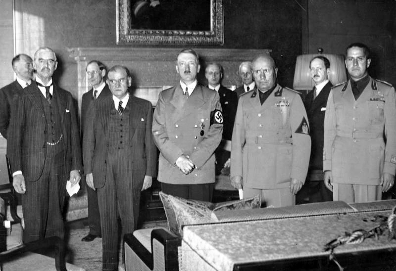
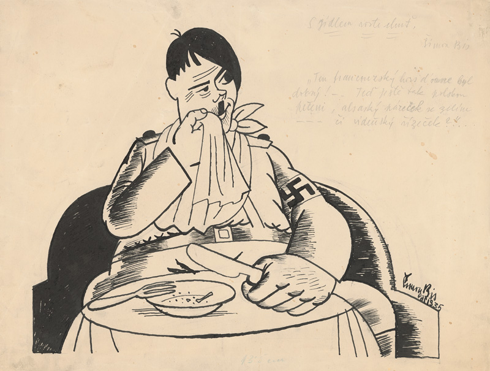

## Mníchovská dohoda
### 29. 9. 1938 {.title-date}

Prvá svetová vojna zmenila usporiadanie Európy a po rozpade Rakúsko-Uhorska vznikla na našom území v roku 1918 prvá Československá republika. Slovensko sa ako jej súčasť zviechalo najprv z následkov vojny, neskôr aj z následkov svetovej hospodárskej krízy, ktorá začala pádom newyorskej burzy v roku 1929 a vyostrila vnútropolitické konflikty aj na našom kontinente. V roku 1933 sa aj vďaka nej dostala moc v Nemecku do rúk Adolfa Hitlera, novozvoleného ríšskeho kancelára, ktorý sa na niekoľko ďalších rokov stal ústredným hýbateľom európskych dejín.

Píše sa rok 1938, keď si nacistické Nemecko tzv. anšlusom násilne pripája Rakúsko. Hitler sa zároveň netají snahami zlikvidovať susedné Československo

Píše sa rok 1938, keď si nacistické Nemecko tzv. anšlusom násilne pripája Rakúsko. Hitler sa zároveň netají snahami zlikvidovať susedné Československo, predsa len – Čechy a Morava majú byť súčasťou plánovanej Veľkonemeckej ríše. Ovládnuť ich chce vojensky, spoliehajúc sa aj na fakt, že na územia Slovenska (pre Hitlera v tom čase pomerne nezaujímavej krajiny) si robia zálusk Maďarsko s Poľskom. Slovenskí susedia sa však do ozbrojeného konfliktu nehrnú a politický nátlak na krajinu nezaberá. Hitler sa preto rozhodne „použiť kartu“ nemeckého obyvateľstva žijúceho a údajnou diskrimináciou trpiaceho za hranicami Nemecka, teda podobnú zámienku, akú použil v prípade pripojenia Rakúska. V hre sú tentoraz Sudety, pohraničné československé oblasti, obývané v prevažnej miere etnickými Nemcami. Nemecko, Taliansko, Veľká Británia a Francúzsko zvolajú na 29. 9. 1938 konferenciu v Mníchove, na ktorej rozhodnú o ďalšom osude Československa bez jeho účasti. Republika má podľa ich rozhodnutia odstúpiť Nemecku sudetské pohraničie. Československá vláda je zaskočená najmä postojom vtedajších spojencov, Francúzska a Veľkej Británie, možností však mnoho nemá. O deň neskôr, 30. 9. 1938 prijíma rozhodnutie, ktoré sa zapisuje do dejín ako Mníchovská dohoda, alebo aj explicitnejšie – Mníchovský diktát. Je jednou z predzvestí blížiacej sa druhej svetovej vojny, pred ktorou však Slovensko čaká niekoľko výrazných politických zmien. Do dejín mu vstupuje Hitler.

<!-- <iframe src="https://archive.org/embed/48-163" width="500" height="140" frameborder="0" webkitallowfullscreen="true" mozallowfullscreen="true" allowfullscreen></iframe> -->

## Hlinkova slovenská ľudová strana (objekt 2)

V čase podpisu Mníchovskej dohody je najsilnejšou politickou stranou na Slovensku Hlinkova slovenská ľudová strana. Pôvodná Slovenská ľudová strana má korene v roku 1905, obnovená však bola jej pôvodným spoluzakladateľom, katolíckym kňazom a národovcom Andrejom Hlinkom, v roku 1913 z dôvodu pretrvávajúcej protikatolíckej orientácie vtedajšej vlády. Strana teda stojí na pevnom kresťanskom základe, je pravicovo orientovaná a prakticky od počiatku presadzujú jej členovia a prívrženci (ľudovo - „ľudáci“) politiku decentralizmu - samostatnejšieho postavenia Slovenska v rámci Československej republiky, ktorej politická moc je sústredená v Prahe. Mottom HSĽS je aj preto totalitne znejúce heslo: „Jeden národ, jedna strana, jeden vodca.“

Vnútri strany na seba narážajú dva prúdy – tzv. umiernené krídlo (reprezentované najmä Jozefom Tisom a Karolom Sidorom) a krídlo radikálne (na čele s Vojtechom Tukom a Alexandrom Machom). Kým prvé je napríklad v otázkach autonómie odhodlané napredovať postupne, druhá skupina sa o ňu snaží okamžite. Podobne rozdielne budú neskôr pristupovať aj k riešeniu tzv. židovskej otázky – umiernenému krídlu bude stačiť obmedzenie počtu Židov vo verejnom hospodárskom živote, radikálne bude požadovať ich absolútne vylúčenie. Ako sa k naliehavým otázkam postaví „jeden národ, jedna strana a jeden vodca“, ktorým sa už onedlho má stať Jozef Tiso?

Andrej Hlinka sa do slovenských dejín zapísal ako politik, publicista, prekladateľ, najmä však ako veľký národovec. Narodil sa ako jeden z deviatich súrodencov v robotníckej rodine a vyštudoval teológiu v seminári v Spišskej kapitule. Počas svojho kaplánskeho pôsobenia na Orave si získal obľubu ľudu a začal sa angažovať aj politicky. Najprv pôsobil v Uhorskej ľudovej strane, ktorá však nenaplnila jeho očakávania v oblasti v riešení otázky nemaďarských národov Uhorska, medzi ktoré v tom čase Slováci patrili. Po krátkom pôsobení v Slovenskej národnej strane sa stal spoluzakladateľom novej Slovenskej ľudovej strany, neskôr aj jej predsedom v dobách najväčšieho rozmachu v medzivojnovom období. Popri svojom pôsobení v strane bol tiež účastníkom a spoluzakladateľom Slovenskej národnej rady v Martine, zakladateľom slovenskej kníhtlačiarne Lev, členom výboru Matice slovenskej, predsedom Spolku svätého Vojtecha, nositeľom titulu pápežský komorník a apoštolským protonotárom. Prežil dokonca dva pokusy o atentát na svoju osobu a skonal v auguste 1938 a na predsedníckom poste ho v strane nahradil Jozef Tiso.

Jozef Tiso, ktorý je bez diskusie jednou z najkontroverznejších postáv slovenských dejín, sa narodil v rodine mäsiara Jozefa Gašpara Tisa. Meno dostal po otcovi, priezvisko Gašpar však nepoužíval. Vysokoškolské štúdium mu vynieslo titul doktora teológie a za kňaza bol vysvätený na základe výnimky, ešte predtým než dosiahol požadovaný vek 24 rokov. Do politiky vstúpil už ako cirkevný hodnostár, v roku 1910 sa stal členom promaďarsky orientovanej Katolíckej ľudovej strany. V roku 1918 však pôsobisko zmenil a stal sa členom výboru Slovenskej ľudovej strany (od roku 1925 nesúcej meno Hlinkova slovenská ľudová strana). V novembri 1925 sa stal poslancom Národného zhromaždenia Československa a onedlho aj predsedom poslaneckého klubu HSĽS, ministrom zdravotníctva a telovýchovy. V tom čase sa s ním už počítalo ako s nástupcom Andreja Hlinku na čele strany.

Po smrti Andreja Hlinku sa v roku 1938 stáva Tiso predsedom HSĽS. Má vtedy za sebou okrem rokov politických skúseností aj skúsenosť učiteľa, vojenského kňaza, dlhoročné pôsobenie ako farár v Bánovciach nad Bebravou, ktorého sa nevzdáva napriek pôsobeniu v politike, a množstvo sociálne prospešných aktivít. U slovenského ľudu sa vďaka tomu teší značnej popularite. Hoci mu je ako obľúbenému konzervatívnemu politikovi cudzí radikalizmus časti jeho spolustraníkov, v istom smere je radikálom aj on sám – HSĽS označuje za jedinú stranu, ktorá môže hovoriť v mene Slovákov preto, že sa usiluje o svojbytnosť ich národa. V čase svojho nástupu na čelo strany však Tiso zrejme netuší, že osamostatnenie Slovenska je bližšie, než by si ktokoľvek trúfol odhadnúť, a že sa udeje aj s jeho výrazným pričinením... 

Novinár Karol Sidor vstúpil do strany ako devätnásťročný. Do roku 1938 bol šéfredaktorom denníka Slovák, v aktuálnom roku sa stáva šéfom tlačových podnikov HSĽS a veliteľom Hlinkových gárd. Spolu s Tisom patrí k umiernenému krídlu strany a pred Hlinkovou smrťou aj k jedným zo zvažovaných nástupcov na predsedníckom poste. Jeho slovenská politická kariéra však už onedlho zlyhá na jeho zásadovosti, keď sa v istom momente odmietne podriadiť nemeckému nátlaku, za čo bude odstránený zo slovenského politického života, aby sa stal vyslancom štátu vo Vatikáne.

Narodený v učiteľskej rodine, Vojtech Tuka mal možnosť študovať právo v Budapešti, Paríži i Berlíne. Stúpencom autonómie bol už pred vstupom do HSĽS, rovnako sa už predtým angažoval antisemitsky. Po vstupe do strany sa veľmi rýchlo stal jedným z jej popredných činiteľov, bol zároveň spoluzakladateľom jej organizácie Rodobrana. Tú inšpirovali fašistické jednotky Nemecka a Talianska a mala zabezpečovať bezproblémový priebeh ľudových zhromaždení. Vďaka procesu známemu ako Tukova aféra bol odsúdený na 15 rokov väzenia za vlastizradu po tom, čo v časopise Slovák vyšiel jeho článok, v ktorom nepriamo vyzýval na vystúpenie Slovenska z Československej republiky. Po prepustení z väzby sa však vrátil do aktívnej politiky, aby sa stal ústrednou postavou radikálneho krídla HSĽS.

V roku 1938 a Vojtech Tuka ešte intenzívnejšie hlása nezávislosť Slovenska. Má podporu samotného Hitlera, ktorému by takýto scenár vyhovoval, a čakajú naňho najúspešnejšie roky politickej kariéry, počas ktorých sa má stať nielen predsedom vlády, ale aj jednou z osôb najvýraznejšie presadzujúcich antisemitské opatrenia v krajine.

Alexander (často prezývaný Šaňo) Mach vyštudoval bohoslovectvo, no kňazom sa nikdy nestal. Ako veľmi mladý začal byť politicky činným a do HSĽS vstúpil v roku 1922, aby sa spolu so svojím „mentorom“ Vojtechom Tukom stal vedúcim predstaviteľom jej radikálneho krídla.

Okrem politickej karéry je v roku 1938 Mach tiež úspešným žurnalistom, už niekoľko rokov pôsobí ako šéfredaktor časopisu Slovák, hlavného tlačového orgánu stranu. Má to byť práve on, kto už onedlho oznámi v rozhlasovom vysielaní osamostatnenie slovenského štátu a po boku Tuku bude viesť protižidovskú politiku, vďaka ktorej sa stane postavou dobovej riekanky: „Od Prešova ide vlak, sedí na ňom Šaňo Mach. Všetci Židia utekajú, lebo majú strach.“

## 7. 10. 1938 – Vyhlásenie autonómie Slovenska (objekt 3)

Priamym následkom Mníchovskej dohody sú okamžité spoločensko-politické zmeny na území východnej Európy, vrátane Československej republiky. Podľa nemeckej analýzy, ktorú si necháva ešte v októbri vypracovať Adolf Hitler, majú Slováci 4 možnosti:

* osamostatniť sa a založiť vlastný štát,
* vyhlásiť autonómiu v rámci Československej republiky,
* vyhlásiť autonómiu s orientáciou na Maďarsko a prípadným spojením so svojím južným susedom
* vyhlásiť autonómiu s orientáciou na svojho severného suseda, Poľsko. 

Slovenská spoločnosť je decentralizácii v značnej miere naklonená, 6. októbra sa preto v Žiline stretnú predstavitelia HSĽS s predstaviteľmi menších politických strán, aby im predstavili svoj návrh autonómie, ktorý napĺňa druhú spomedzi štyroch možností, autonómiu v rámci existujúcej republiky. V Manifeste slovenského národa, ktorý na žilinskej konferencii HSĽS vypracuje, sa Slovensko hlási k „mierovému riešeniu sporov v duchu mníchovskej dohody“ a v konečnom dôsledku tak nahráva do karát nacistickému Nemecku.

7\. októbra 1938 pražský parlament prijíma návrh HSĽS a jej predsedu Jozefa Tisa vyhlasuje za predsedu vlády autonómnej Slovenskej krajiny. Československu tak do názvu pribúda spojovník a oficiálne sa stáva Česko-Slovenskou republikou. Pred tou okamžite stojí prvá z významných povinností – do troch mesiacov od prijatia Mníchovskej dohody vyriešiť otázku poľskej a maďarskej národnostnej menšiny. Bez jasnej stratégie sa tak česko-slovenská strana pod Tisovým vedením púšťa do rokovaní so svojimi susedmi, ktoré vedú v novembri toho istého roku do tzv. viedenskej arbitráže, v ktorej Slovensko stráca časť svojho územia.

Slovenská krajina sa 7. októbra 1938 stáva autonómnou republikou v štátnom útvare zvanom Česko-Slovenská republika. Autonómia (z gréckeho autonomos – majúci vlastné zákony) zaručuje autonómnemu územiu právo na vlastné normy a vlastné orgány, prostredníctvom ktorých bude riešiť samostatné otázky v rámci vyššieho celku. Slovensko tak zakladá vlastnú vládu, na čele ktorej stojí predseda Jozef Tiso, zostavuje vlastný ústavný zákon aj vlastný snem, ktorý prvýkrát zasadá v januári 1939. V tom čase už je HSĽS zlúčená s menšími slovenskými stranami, stáva sa jediným formálnym reprezentantom slovenského národa a okrem nej je povolená činnosť len menšinovej nemeckej a maďarskej strane. 

### Národ

Pojmom národ označujeme spoločenstvo osôb, ktoré sa vyformovalo pôsobením viacerých faktorov, najčastejšie na spoločnom území, s rovnakým jazykom, podobnou kultúrou, vierou a hodnotami. Etnografia často uvádza, že národy vznikali spájaním príbuzných kmeňov do národností (etnos), nahrádzaním pokrvných zväzkov za zväzky územné a tvorbou spoločného jazyka. Počiatky moderného slovenského národa môžeme hľadať na konci 18. storočia, rozšírenou je však aj nepodložená teória, podľa ktorej môžeme o národnom povedomí hovoriť prakticky od čias Veľkomoravskej ríše a za vyvrcholenie snáh o národný štát považovať práve snahy autonomistov. Heslo „Za Boha život, za národ slobodu,“ ktorého autorstvo býva často pripisované Andrejovi Hlinkovi, vystihuje hodnotové nastavenie vedúcich politických predstaviteľov slovenského národa v časoch autonómie, ktorého základnými piliermi sú práve národnosť a kresťanská viera. 

## 2. 11. 1938 - Viedenská arbitráž (objekt 4)

Mníchovský diktát pripravil Československú republiku o územia obývané nemeckým obyvateľstvom a keďže sa autonómne Slovensko zaviazalo viesť svoju politiku v „duchu mníchovskej dohody“, začína byť jasné, že nároky Maďarska na územie obývané príslušníkmi a príslušníčkami svojho národa na seba nenechajú dlho čakať. V hre je takmer pätina rozlohy Slovenska, vrátane oblasti Podkarpatskej Rusi, ktorá mu prináleží, 800 000 obyvateľov tohto územia, z nich asi 250 000 Slovákov a Sloveniek.

Oficiálne rokovania medzi česko-slovenskou a maďarskou stranou však nevedú k rozhodnutiu, zasiahne teda Hitler a rozsiahle územia Slovenska si tzv. viedenskou arbitrážou (riešenie sporov splnomocnenými rozhodcami) pripojí Maďarsko. Svoj kus zeme si však na základe mníchovského princípu nárokuje aj Poľsko, ku ktorému sú pripojené viaceré obce Oravy a Spiša.

V novonadobudnutej časti Maďarska sa slovenské obyvateľstvo, ktoré zostalo obývať svoje domovy, stáva takmer okamžite obeťou prenasledovania, ponižovania, násilia či otvorených perzekúcií. Štát dokáže evakuovať a poskytnúť nové pôsobisko 50 000 Slovákom a Sloveniek, z ďalších osôb, ktoré kvôli zlým podmienkam utekajú na slovenské územie, sa stávajú utečenci. Podľa niektorých odhadov je to v rokoch 1938 – 1943 až 100 000 osôb, ktoré sú po úteku z maďarského na slovenské územie odkázané na charitatívnu pomoc a nízke núdzové dávky od štátu. Počet vysťahovalcov zo Slovenska do Maďarska je výrazne nižší, keďže na zvyšku slovenského územia ich žijú len veľmi malé počty, dochádza však aj k takým prípadom. Na podnet radikálneho krídla HSĽS, ktoré má podporu Nemecka, je po vyhlásení autonómie vysťahovaných z územia Slovenska aj vyše 9 000 českých štátnych zamestnancov a učiteľov, z veľkej časti tých, ktorí prišli svojho času pomôcť krajine, keď nemala dosť vlastných kapacít.

## 18. 12. 1938 - Voľby do autonómneho Snemu Slovenskej krajiny (objekt 5)

Autonómna vláda vyhlasuje voľby do Snemu novovzniknutej Slovenskej krajiny v sobotu 26. 11. 1938 s dátumom konania 18. 12. 1938. Kandidátne listiny je nevyhnutné podať 3 týždne pred dňom konania volieb, teda najneskôr v nedeľu 27. 11. 1938. HSĽS si tak poisťuje, že bude jedinou uznanou kandidátnou listinou listina HSĽS – Strany slovenskej národnej jednoty, teda politického zoskupenia, v ktorom ostaté meštianske strany splynuli s HSĽS, čím prakticky prestali existovať. Na kandidátke figurujú v malom počte tiež zástupcovia menších spojených strán a národnostných menšín, okrem nežiadúcej českej a židovskej minority. Na základe potreby „jednoty národa“ sa začína potláčať sloboda tlače a zhromažďovania, HSĽS – SSNJ nechce, aby sa jej víťazstvu vo voľbách stavali do cesty neprajníci.

Krátko pred voľbami vydáva ministerstvo vnútra tajnú inštrukciu pre okresné úrady, podľa ktorej majú národnostne zmiešané územia vytvoriť osobitné volebné miestnosti pre rôzne národnosti, aby mohli jednoduchšie zistiť, ako volia príslušníci tých ostatných. Menšinové národnosti však preukazujú korektnosť a vo voľbách, kde nemôžu vybrať politickú stranu, iba prijať, či odmietnuť predloženú kandidátnu listinu, odpovedá 97,3% voličov a voličiek kladne na sugestívnu otázku: „Chceš nové a šťastné Slovensko?“

## 14. 3. 1939 - Vznik Slovenského štátu

Hoci stál Adolf Hitler v pozadí udalostí, ktoré sa na slovenskom území udiali v roku 1938, jeho konečným cieľom nebolo ani odtrhnutie českého pohraničia, ani slovenská autonómia. Ďalším krokom má byť rozdelenie Česko-Slovenska a pripojenie Čiech a Moravy k Veľkonemeckej ríši. Nemôže k nemu dôjsť násilnou cestou, keďže sa Nemecko Mníchovskou dohodou zaviazalo garantovať oklieštenému Česko-Slovensku bezpečnosť a celistvosť. Ak však Slovensko vyhlási samostatnosť a Česko-Slovenská republika prestane existovať, nebudú na ňu platiť podmienky dohody a Nemecko bude môcť vytúžené územia obsadiť bez toho, aby riskovalo konflikt s ostatnými mocnosťami. Pomôcť mu v tom má HSĽS...     Radikálne krídlo HSĽS, zastúpené Tukom, Machom a Ferdinandom Ďurčanským, jedným z ministrov autonómnej vlády, sa na prelome rokov 1938 a 1939 viackrát stretá s nemeckými predstaviteľmi a bez vedomia slovenskej vlády prezentuje myšlienku vyhlásenia samostatnosti ako bezproblémovú. Tuka dokonca počas návštevy u Hitlera otvorene vyhlasuje: „Môj vodca, osud svojho národa vkladám do vašich rúk. Môj národ od vás očakáva oslobodenie.“ Doma však vláda, snem i vedenie HSĽS odmieta návrhy radikálov a k samostatnému štátu chce naďalej dospieť vo vzdialenej budúcnosti prirodzeným vývojom, teda evolúciou namiesto revolúcie podľa Tukových predstáv. V súlade s Hitlerovým záujmom sa česko-slovenská vláda v Prahe dozvedá o slovenských tendenciách osamostatniť sa a 9. marca na ne reaguje vojenským zásahom. Na území Slovenska je po ňom vyhlásená vojenská diktatúra, Jozef Tiso odvolaný z funkcie predsedu vlády a na jeho miesto dosadený stranícky kolega Karol Sidor. Po tom, čo Sidor za takýchto podmienok odmietne vyhlásiť samostatnosť, Hitler úradne pozve Tisa do Berlína, kde ho varuje, že ak nevyhlási samostatnosť ani on, „ponechá Slovensko svojmu osudu.“ Spomenutým osudom má byť pripojenie k Maďarsku, alebo rozdelenie územia medzi trojicu susedov – Nemecko (ktorému po anšluse prislúcha Rakúsko), Poľsko a Maďarsko, ktorého jednotky sa už údajne presúvajú k hraniciam. Hoci Jozef Tiso v tej chvíli nie je oficiálnym predstaviteľom Slovenska, vďaka Hitlerovej podpore môže požiadať prezidenta Emila Háchu o zvolanie snemu na 14. marca 1939. Snem Slovenskej krajiny na svojom zasadnutí vyhlási vytvorenie samostatného Slovenského štátu a Hitlerove vojská hneď nasledujúci deň vstúpia na české územie, aby ho vyhlásili za Protektorát Čechy a Morava, začlenený do Nemeckej ríše. Novovzniknutý Slovenský štát čaká 5 rokov existencie poznačenej nezvratnou druhou svetovou vojnou.

### Hej, Slováci (podobjekt)

Evanjelický kňaz, básnik a historik Samuel Tomášik napísal hymnickú pieseň s názvom Hej, Slováci ešte v roku 1834, keď ho nahnevalo, že v uliciach Prahy počuje nemeckú reč viac ako tú českú. U nás je známa najmä ako oficiálna hymna prvej Slovenskej republiky (1939 – 1945), no okrem toho, že jej vznik inšpiroval pomer češtiny a nemčiny, jej nápev vychádza z poľského hudobného podkladu a hymnou sa neskôr stala aj v Juhoslávii, Srbsku či Čiernej hore.

 
#### Text:

Hej, Slováci, ešte naša  slovenská reč žije,  Dokiaľ naše verné srdce  za náš národ bije.

Žije, žije, duch slovenský,  bude žiť naveky,  Hrom a peklo, márne vaše  proti nám sú vzteky!

Jazyka dar zveril nám Boh,  Boh náš hromovládny,  Nesmie nám ho teda vyrvať  na tom svete žiadny;

I nechže je koľko ľudí,  toľko čertov v svete;  Boh je s nami: kto proti nám,  toho Parom zmetie.

A nechže sa i nad nami  hrozná búrka vznesie,  Skala puká, dub sa láme  a zem nech sa trasie;

My stojíme stále pevne,  ako múry hradné.  Čierna zem pohltí toho,  kto odstúpi zradne!

