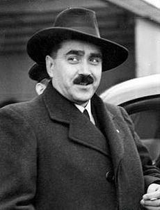

.jpg)
Novinár Karol Sidor vstúpil do strany ako devätnásťročný. Do roku 1938 bol hlavným redaktorom denníka Slovák, v aktuálnom roku sa stáva šéfom tlačových podnikov HSĽS a veliteľom Hlinkovej gardy. Spolu s Tisom patrí pred Hlinkovou smrťou aj k jedným zo zvažovaných nástupcov na predsedníckom poste. Hoci mal Karol Sidor samostatnosť Slovenska vo svojom politickom programe, v marcii 1939 odmietol prijať nacistický nátlak vyhlásiť samostatnosť, čo malo veľmi nepriaznivý vplyv na jeho politickú kariéru. Bol odstránený z vrcholovej politiky na Slovensku a stal sa vyslancom Slovenskej republiky vo Vatikáne.