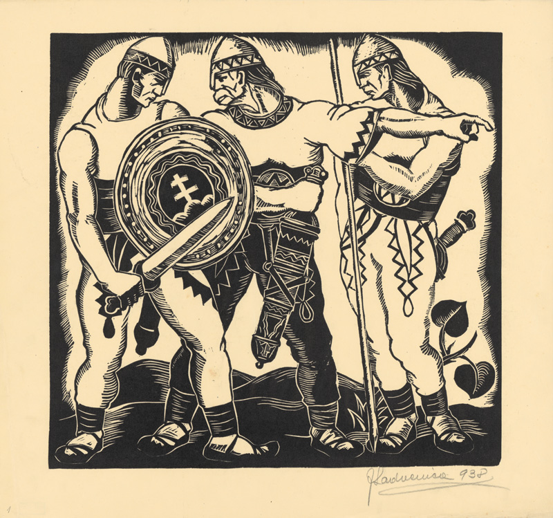

Slovenská krajina 7. októbra 1938 nadobudla autonómne postavenie v štátnom útvare zvanom Česko-Slovenská republika. Autonómia (z gréckeho autonomos – majúci vlastné zákony) znamenala prenos niektorých právomocí z centrálnej vlády na autonómnu. Na Slovensku tak vzniká vláda, na čele ktorej stojí Jozef Tiso. Jej snem prvýkrát zasadá v januári 1939. V tom čase už HSĽS pohltila alebo zakázala ostatné slovenské strany a vyhlasuje sa za jedinú politickú reprezentantku slovenského národa. Okrem nej je povolená činnosť len menšinovej nemeckej a maďarskej politickej strane. HSĽS sa snaží postupne ovládnuť aj spoločenský a kultúrny život – Hlinkova garda preberá majetok rozpustených spolkov, zanikajú mnohé noviny a časopisy, silnie cenzúra.