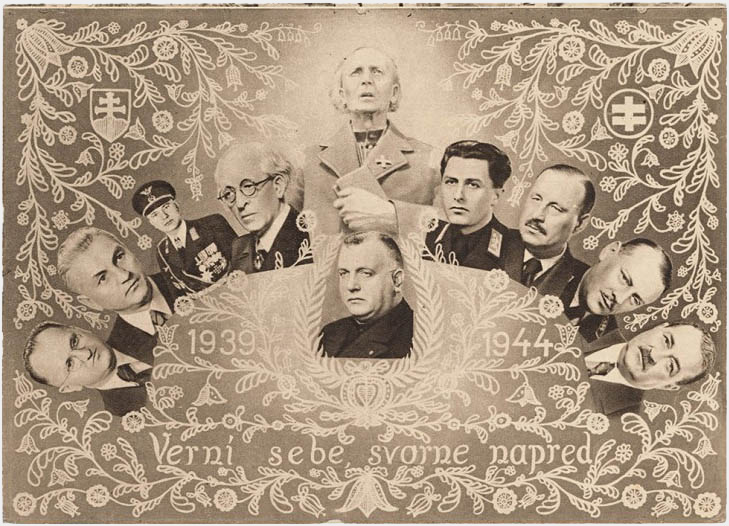
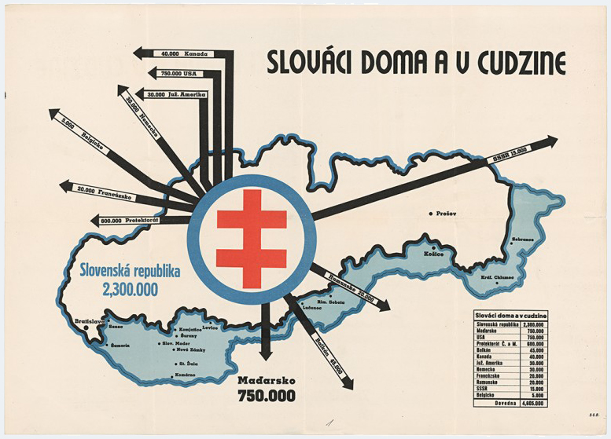
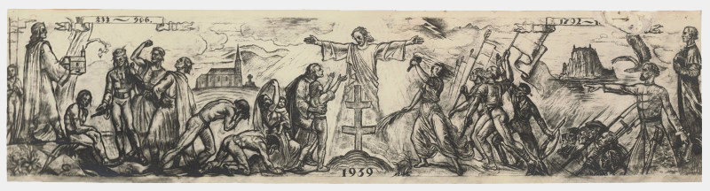

## Munich Agreement
### 29. 9. 1938 {.title-date}

The First World War changed the landscape of Europe. After the collapse of the Austro-Hungarian Empire, the First Czechoslovak Republic was established. Slovakia, as a part of the republic, first faced the aftermath of the war and later the Great Depression caused by the Wall Street Crash of 1929, which exacerbated the internal political conflicts on our continent. In 1933, Adolf Hitler won the German general elections and became the new Reich Chancellor, an event that would determine the course of European history for the next decade..

The year is 1938 and Nazi Germany in the so-called Anschluss annexes Austria. Hitler doesn't hide his intentions to seize the neighbouring Czechoslovakia.

Hitler is trying to break up Czechoslovakia, which as a democratic country offered a refuge to the opponents of Nazism. Hitler was raising territory claims, willing to proceed through international political agitation or resort to military action. He was definitely playing the German population card - Germans living and allegedly suffering from discrimination beyond the German borders - a similar excuse as he used when he annexed Austria. It suited him that the territory of Slovakia (a relatively uninteresting country for Hitler at the time) was eyed by both Poland and Hungary. The Sudetenland and the border areas of Czechoslovakia, inhabited mostly by ethnic Germans, are at stake now.

<figure class="audio" markdown="1">

<figcaption>Speech by Adolf Hitler to the Nazi Party Congress in Nuremberg on 12 September 1938, in which he sharply attacked Czechoslovakia and President Eduard Benes.</figcaption>
</figure>

Germany, Italy, Great Britain and France convened in Munich on 29 September 1938, where they decided on the fate of Czechoslovakia without its presence at the table. The Republic must cede Sudeten territory to Germany. The Czechoslovak government was particularly surprised by the attitude of their allies, France and Great Britain, but did not have any other options. A day later, on 30 September 1938, they accepted the decision, which went down in history as the Munich Agreement, sometimes called the Munich Dictate. It was one of the heralds of the coming war, before which, however, Slovakia went through several drastic political changes. 

<figure class="video">    
<iframe src="https://player.vimeo.com/video/190295173?title=0&byline=0&portrait=0" width="800" height="450" frameborder="0" webkitallowfullscreen mozallowfullscreen allowfullscreen></iframe>
<figcaption><a href="http://www.webumenia.sk/dielo/SVK:TMP.114?collection=82">Imro Weiner-Kráľ: War Is Coming. 1938. GMB, Bratislava</a></figcaption>
</figure>

---
## Hlinka's Slovak People's Party

At the time of the Munich Agreement, the most influential political party in Slovakia was Hlinka's Slovak People's Party (HSPP), which in 1935 in coalition with the Slovak National Party won 30% of the votes in the elections. It was founded as Slovak People's Party in 1905, then restored by a Catholic priest and a nationalist, Andrej Hlinka. It was founded on conservative Christian values and slowly but surely became obsessed with the idea of autonomy - an independent Slovakia within the Czechoslovak Republic.   

The HSPP's gradual radicalisation was epitomised by their totalitarian motto: "One Nation, One Party, One Leader."  

During October 1938, the HSPP strived to solve the issue of Slovakia within the Republic and pushed for autonomy. Within the party, there were two conflicting approaches, the so-called moderate wing (represented mainly by Jozef Tiso, Jozef Sivák and Martin Sokol) and the radical wing (led by Vojtech Tuka, Ferdinand Ďurčanský and Alexander Mach). They differed in their views on autonomy and disagreed on antisemitic legislation. What was the answer of "one nation, one party and one leader" - soon to be Jozef Tiso - to these burning questions?

{% include 'partials/subobjects.html.twig' with {
	'title': 'Find out more about the figures of the HSPP',
	'subobjects': [
    	{
        	'name':'Andrej Hlinka',
        	'thumbnail': page.media['Andrej_Hlinka.jpg'],
        	'href': '1/hlinka'
    	},
    	{
        	'name':'Jozef Tiso',
        	'thumbnail': page.media['Jozef_Tiso.jpg'],
        	'href': '1/tiso'
    	},
    	{
        	'name':'Karol Sidor',
        	'thumbnail': page.media['Karol_Sidor.jpg'],
        	'href': '1/sidor'
    	},
            	{
        	'name':'Vojtech Tuka',
        	'thumbnail': page.media['Vojtech_Tuka.jpg'],
        	'href': '1/tuka'
    	},
            	{
        	'name':'Alexander Mach',
        	'thumbnail': page.media['Alexander_Mach.jpg'],
        	'href': '1/mach'
    	}
	]
}%}

---
## Declaration of Slovak's Autonomy
### 6. 10. 1938 {.title-date}

The direct consequence of the Munich Agreement were the immediate social and political changes in Central and Eastern Europe. According to the German analysis, requested by Adolf Hitler in October, Slovak people had four options:

- declaring independence and founding their own state, 
- declaring autonomy within the Czechoslovak Republic, 
- declaring autonomy with a focus on Hungary and a possible merger with their southern neighbour,
- declaring autonomy with a focus on their northern neighbour, Poland. 

On 6 October, the representives from the HSPP meet in Žilina with representatives of smaller political parties to introduce their proposal for Slovak autonomy within the Czechoslovak Republic. In the documents presented at the Žilina Conference, the HSPP claimed that Slovakia welcomes a "peaceful solution of the problem in the spirit of the Munich Agreement." In their manifesto, the party welcomed the Munich Agreement and emphasised their commitment to "stand by the side of nations fighting against the Marxist-Jewish ideology of disruption and violence." They also insisted on "immediate take-over of executive and governmental powers in Slovakia by the Slovak people." It soon became clear that in understanding of the HSPP politicians, they were the only legitimate representatives of the Slovak people. 

On 7 October 1938, the Czechoslovak government accepted the proposal by the HSPP. Jozef Tiso was declared the Prime Minister of the Autonomous Slovak Region. 

The National Assembly of 19 November 1938 confirmed the autonomy by a constitutional law. Czechoslovakia gained a hyphen in a name and becomes the Czecho-Slovak Republic. From this moment, Slovakia is facing another challenge - rising demands from Hungary and Poland. At the meeting in Komárno, the Czecho-Slovak side, led by Tiso and without a clear strategy, started negotiations with Hungary. These negotiations lasted till November 1938 and resulted in the First Vienna Arbitration, in which Slovakia lost parts of its territory. 



---
## Vienna Arbitration
### 2. 11. 1938  {.title-date}

The Munich Dictate cost the Czechoslovak Republic the territories occupied by the Germans. Because the appendix to the Munich Agreement spoke about solving the problem of Hungarian and Polish minorities within three months of signing, it became very clear that Hungarian territorial claims will not wait long. They were talking about a fifth of the territory of Slovakia, including Carpathian Ruthenia and 854,218 inhabitants of this region, including 272,145 Slovak and Czech nationals. 

The official negotiations between the Czecho-Slovak and Hungarian sides did not lead to a clear decision. Both countries turned to the signatories of the Munich Agreement and the large areas of Slovakia were annexed by Hungary through the so-called Vienna Award.

Poland also claimed their piece of land, based on the Munich precedent, including several villages of Orava, Kysuce and Spiš.
In the newly acquired parts of Hungary, the Slovak population that remained in their homes became an immediate target of oppression, humiliation, violence or even open persecution. The state was able to evacuate and shelter 50,000 Slovaks. Other people feeling to Slovakia due to the bad conditions became refugees. According to some estimates, up to 100,000 people during 1938-1943 took refuge in Slovakia and became dependant on charity and state benefits after fleeing from Hungary. The number of emigrants from Slovakia to Hungary was significantly lower, since there were very few Hungarian nationals living outside the contested territories. At the initiative of the HPSS, after the declaration of autonomy further 9,000 Czech state employees and teachers were deported, including those who voluntarily came to help out a country which did not have their own sufficient resources.

Shortly after the declaration of autonomy, the verbal attacks on the Jewish minority escalate and from 4 November, the populist regime organised a deportation of more than 7,500 people from Slovakia to the arbitration territories. The government also started with a preparation of the anti-Semitic legislation, under the leadership of Karol Sidor. 

---
## Autonomous Slovak Diet Elections
### 18. 12. 1938 {.title-date}

The autonomous government called for elections to the Diet of the newly created Slovak Region on Saturday 26 November 1938 with the date of the election on 18 December 1938. Since the lists of candidates were required to be submitted three weeks before the election, the latest day of submission was Sunday 27 November 1938. The HSPP therefore ensured that the list of candidates of the HSPP - Party of Slovak National Unity would be the only one accepted. Their list of candidates also included the representatives of affiliated parties and minorities, except the unwanted Czech and Jewish minorities. Based on the needs of "unity of the nation", they started suppressing the freedom of the press and the freedom of assembly. 

Shortly before the elections, the Ministry of Interior issued secret instructions, according to which the regions with ethnically mixed population should create a special polling stations for the various nationalities so it would be easier to detect how they voted. 

In elections, where one cannot choose a political party, but only accept or reject the submitted list of candidates, 97,3% of voters replied positively to the suggestive question: "Do you want a new and happy Slovakia?"

---
## Creation of the Slovak State
### 14. 3. 1939  {.title-date}

Although Adolf Hitler stood in the background of the events that took place in the Slovak territory in 1938, his final goal wasn't annexation of Czech borderlands nor Slovak autonomy. His next step was a division of Czecho-Slovakia and the annexation of Bohemia and Moravia to the German Reich. It could not happen through military occupation, since Germany promised to guarantee security and integrity of the shrunken Czechoslovakia in the Munich Agreement. If, however, Slovakia declared independence and Czecho-Slovakia ceased to exist, the former terms of agreement did not apply anymore and Germany could occupy the desired territories without risking conflict with the other powers. The HSPP was going to help Hitler with this...

The radical wing of the HSPP, represented by Tuka, Mach and Ferdinand Ďurčanský, one of the ministers of the autonomous government, met with the German diplomats several times at the turn of 1938 and 1939 without the knowledge of the Slovak government. They presented the idea of declaring independence as unproblematic.

Tuka during a visit with Hitler declared: "My leader, I put the fate of my nation into your hands. My nation wants you to liberate them." 

At home, the government, the Diet and the leadership of the HSPP rejected the proposition of the radicals since they envisioned the graduation to an independent state in the distant future through a natural progression, meaning through an evolution and not Tuka's revolution. In accordance with Hitler's interest, the Czecho-Slovak government in Prague found out about the Slovak tendencies to independence and responded by military action on 9 March 1939. Military dictatorship was declared on the Slovak territory, Jozef Tiso is dismissed from his post as the Prime Minister and Karol Sidor, Tiso's colleague from the party, named into this function.  

After Sidor rejected the pressure from the Nazis to declare independence, Hitler invited Jozef Tiso to Berlin, where he de facto threatened him that if Slovakia did not declare independence (in the next few hours), he would "abandon Slovakia to its fate." The said fate might have been a division of the territory between their three neighbours - Germany, Poland and Hungary, whose troops were allegedly already moving to the borders. Despite the fact that Jozef Tiso was not an official representative of Slovakia at the moment, thanks to Hitler's support he asked the president Emil Hácha to call the Diet on 14 March 1939. At the meeting, the Slovak Diet declared the creation of the Slovak State and Hitler's troops entered the Czech territories the next day, declaring the Protectorate of Bohemia and Moravia, within the German Reich. The newly created Slovak State was facing the five years of its existence, marked by the Second World War. 



---
**All artworks in this chapter can also be found in the collection at the Web of Art: [Halfway to the Slovak State](http://www.webumenia.sk/kolekcia/82 "Halfway to the Slovak State").**