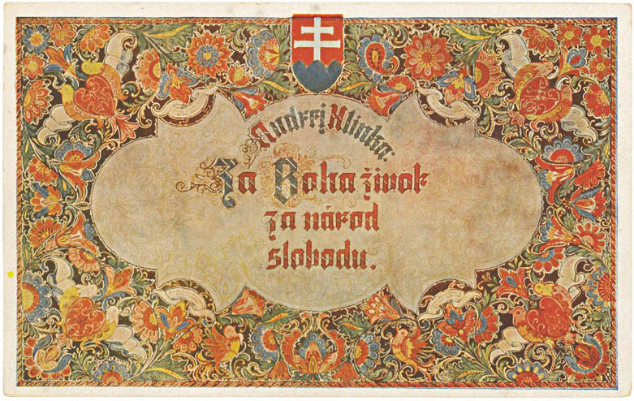

The term nation means a large body of people united by common territory, codified language, common culture, religion and values. The concept of the modern Slovak nation was created only at the end of the 18th and the beginning of 19th century. Quite common is also the unfounded theory that our national consciousness goes back to the Great Moravian Empire and that the culmination of the nation state efforts was the work of the autonomists creating the Slovak State. The motto "Life for God. Freedom for nation," which is often attributed to Andrej Hlinka, describes the dedication and values of the populist leaders at the time; values based on nationalism and Christianity. 

## Other Media

