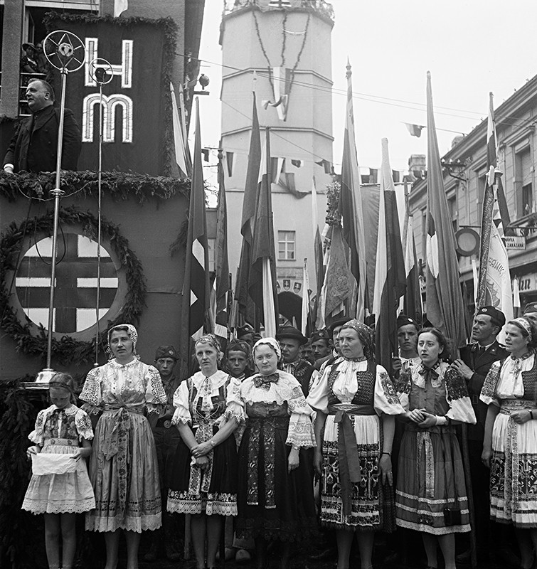

Jozef Tiso was born to the family of Jozef Gašpar Tiso, a butcher. He graduated as a Doctor of Theology and was ordained a priest before he even reached the required age of 24 years. He entered politics already as a church dignitary and in 1910, he became a member of pro-Hungarian oriented Catholic People's Party. In 1918 he changed his affiliation and became a member of the Committee of the Slovak People's Party (from 1925 named Hlinka's Slovak People's Party). In November 1925, he became a member of the National Assembly of Czechoslovakia and soon after he also became the chairman of the HSPP parliamentary group and the Minster of Health and Sports. He was at the top of the party leadership. 

After the death of Andrej Hlinka, Tiso becomes the Chairman of the HSPP. He had years of political experience and also an experience as a teacher,  military chaplain, and many years working as a priest in Bánovce nad Bebravou, which he didn't abandon despite his active political life. As a conservative Catholic politician, in contrast to his fellow party members, he disliked radicalism. His political style was, however, difficult to reconcile with democracy - the HSPP saw itself as the only party speaking in the name of the Slovak nation. During the era of Andrej Hlinka, Tiso probably has no idea that the fulfilment of the autonomy, even the independence of Slovakia, was closer than anyone would guess, and that he would become instrumental figure in these events.

## Other Media
