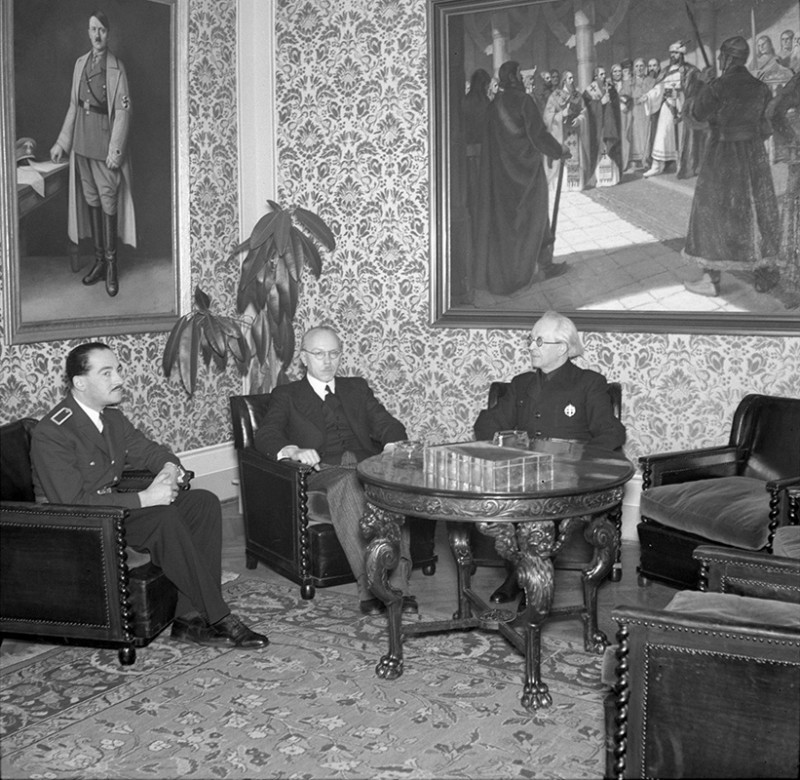

As a son from the family of a teacher, Vojtech Tuka had an opportunity to study in Budapest, Paris and Berlin. In the 1920s, he became a co-founder of the paramilitary organisation at the HSPP called Rodobrana. He also represented the HSPP at the National Assembly. In 1929, he was convicted of a treason and espionage for Hungary. He returned to politics only after the declaration of autonomy in the autumn of 1938. He was a representative of the radical wing of the HSPP, together with Alexander Macha and Ferdinand Ďurčanský. He was a staunch supporter of the Slovak independence and even in Adolf Hitler's plans, he was the person who could be willing to declare independence. During the war, his career flourished. He became the Prime Minister and Minister of Foreign Affairs, but also one of the driving forces of the anti-Semitic rhetoric in the country. 

## Other Media
