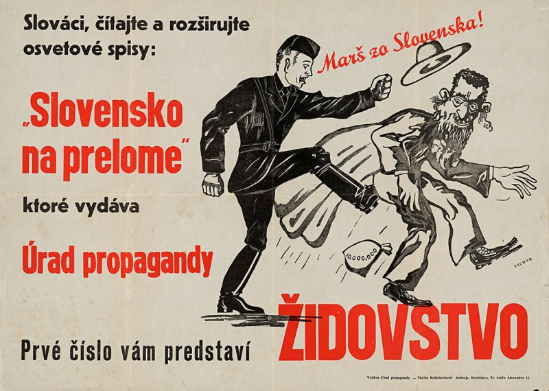
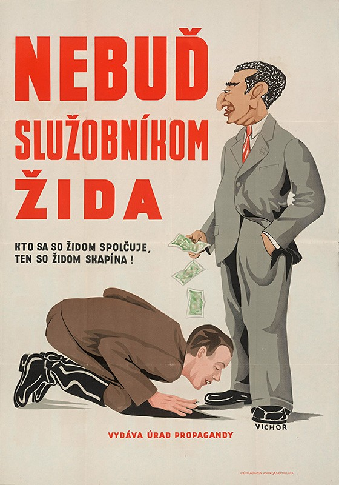
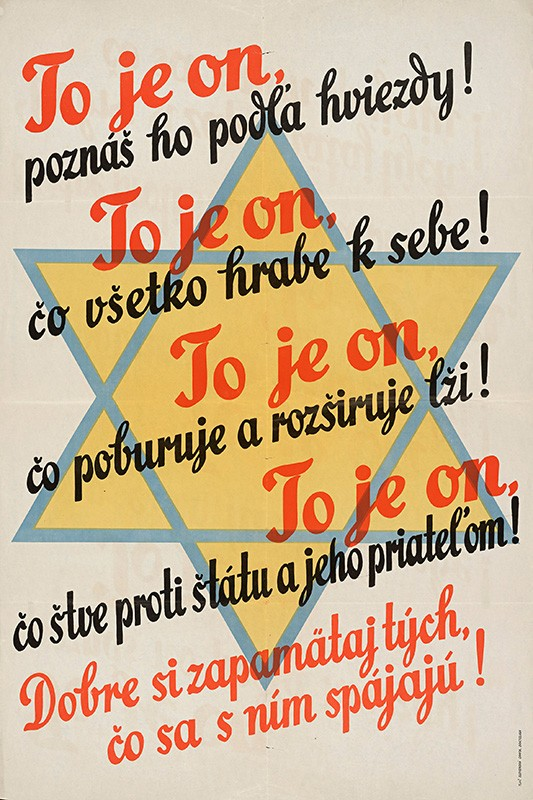
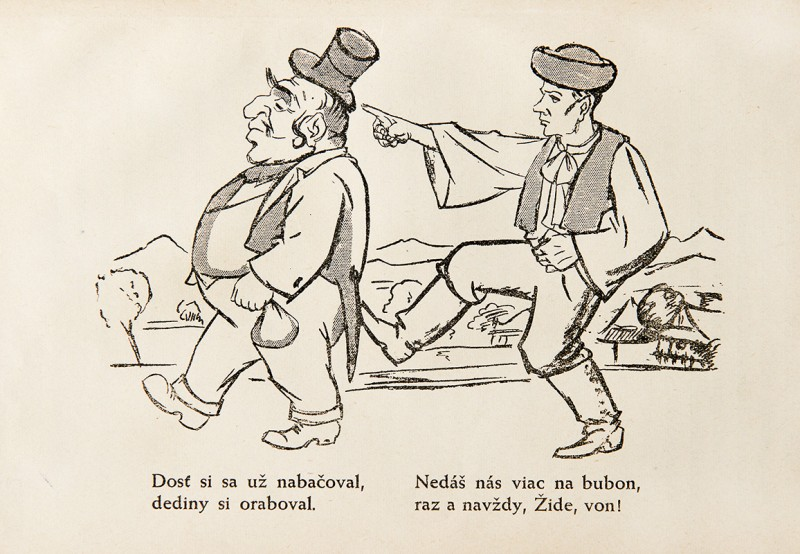
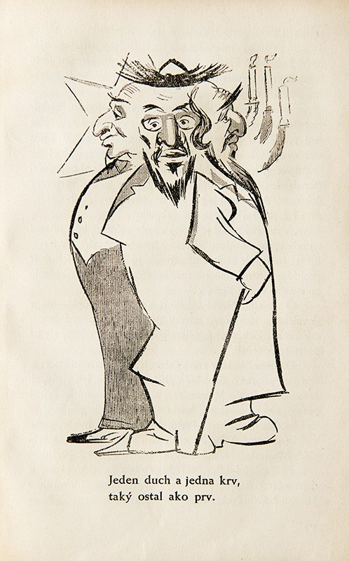
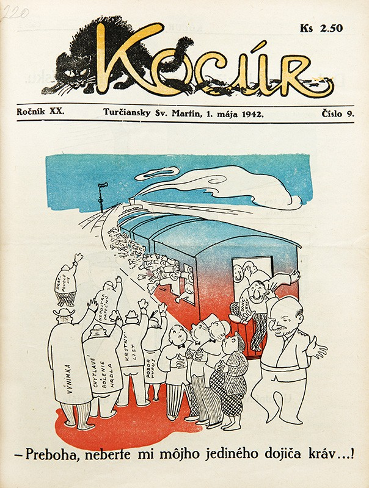
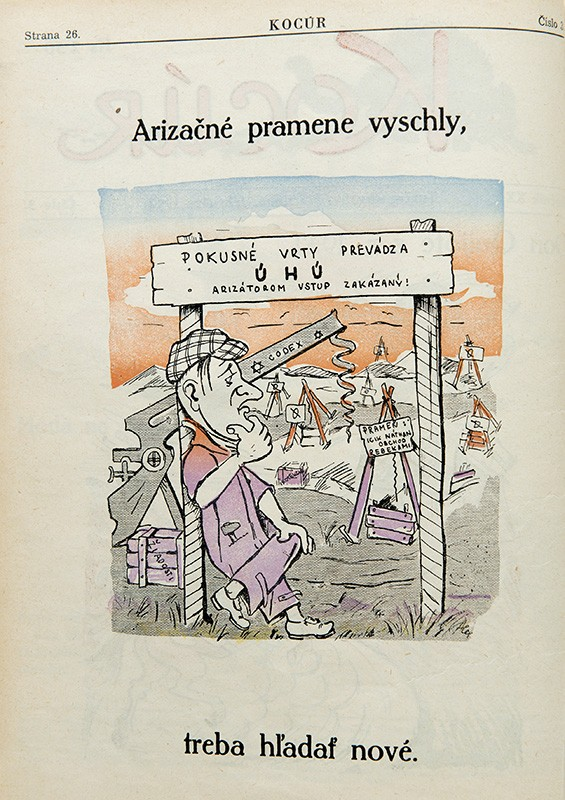
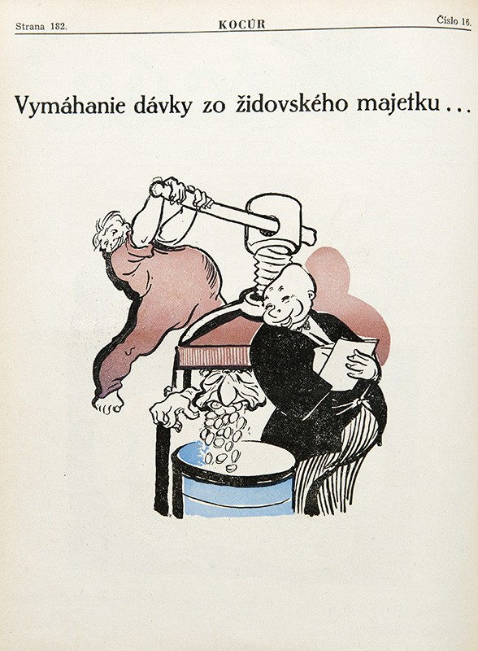
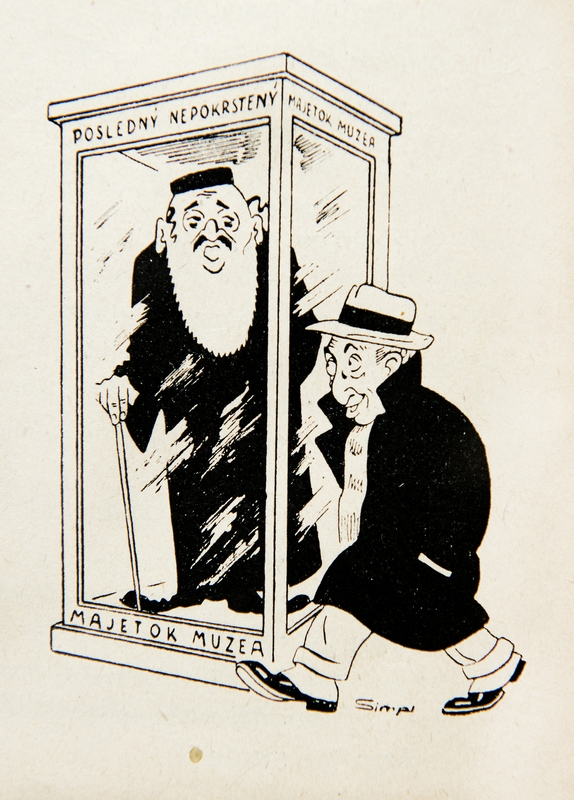
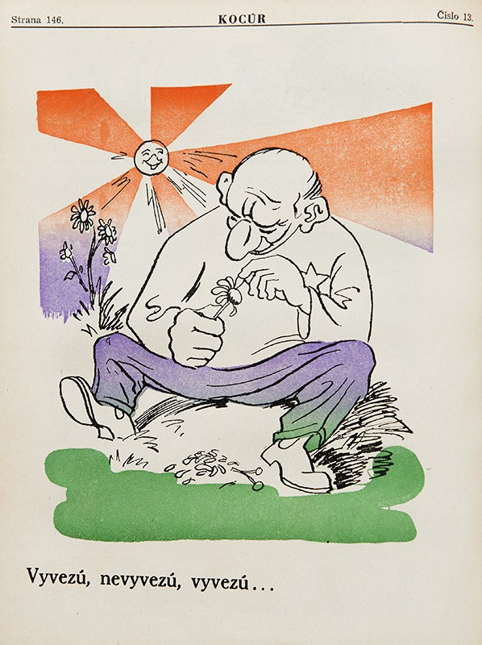

Prevod židovského majetku do „kresťanských“ rúk, tzv. arizácia, sa začína pripravovať už po vzniku štátu v marci 1939. Túto štátom riadenú lúpež nazývajú ľudáci „vylúčením Židov z hospodárskeho a sociálneho života“. Úvodné vládne nariadenia arizačného procesu, ktoré prijala vláda vedená ešte Jozefom Tisom, umožňujú odobrať Židom živnosť alebo dosadiť do podniku tzv. dočasného správcu, prípadne dôverníka, ak existujú proti majiteľovi „námietky z hľadiska spoľahlivosti, verejného záujmu alebo sociálne dôvody“. 

Na jar a v lete 1940 sa začína arizácia poľnohospodárskeho majetku a firiem (podnikov). V ďalšej etape, ktorá nastupuje po salzburských rokovaniach, sa arizácia sprísňuje a rozhodovanie o nej preberá najmä novozriadený Ústredný hospodársky úrad. Na konci roka 1940 už existujú právne normy, ktoré umožňujú odobrať Židom majetok všetkých typov – poľnohospodársky, podnikový, domový, hnuteľný i vklady v bankách. Arizácia, poznačená korupciou a klientelizmom, kulminuje v rokoch 1941 a 1942.

V rámci tzv. arizácie sú židovskému obyvateľstvu na Slovensku odobraté všetky druhy majetkov v celkovej hodnote asi 4 miliárd korún slovenských. V jej dôsledku stráca väčšina Židov žijúcich na Slovensku schopnosť uživiť sa. Stávajú sa sociálnym bremenom štátu, ktorý ich pripravil o všetko.

+++ Carousel karikatury +++

