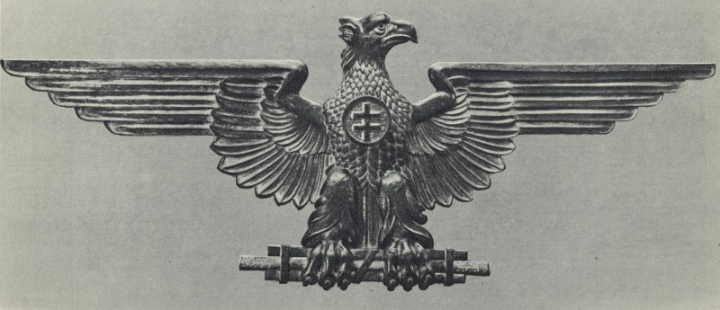

Od marcového vyhlásenia samostatnosti do schválenia ústavy bol oficiálnym názvom krajiny „Slovenský štát“. Od 21. júla ústava zakotvila názov „Slovenská republika“. Výraz „res publica“ (vec verejná) však reflektuje politický republikánsky charakter zriadenia, predpokladajúci legálne súperenie politických síl. Zaužívanejším preto ostane neoficiálne označenie „slovenský štát“. Uprednostňujú ho i sami ľudáci, ktorých hrdosť pramení z vyhlásenia štátu ako takého.

