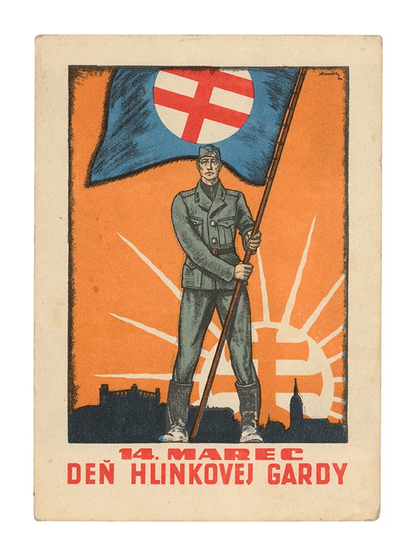
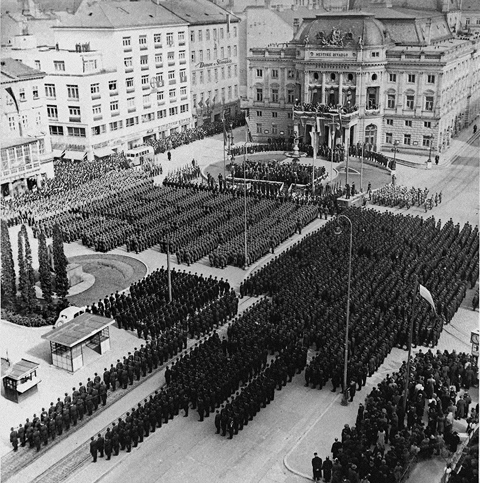
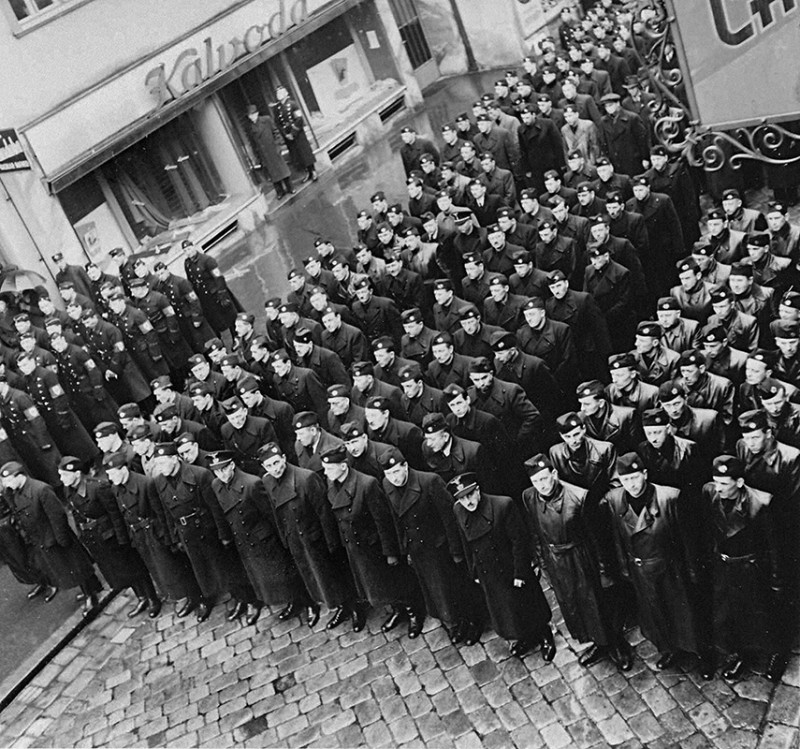

Budovaná podľa nacistického vzoru, je polovojenská organizácia Hlinkova garda najdôležitejšou politicko-mocenskou oporou režimu a súčasťou jeho represívno-bezpečnostného aparátu. Od pôvodne uzákoneného povinného členstva pre všetkých mužov od 6 do 60 rokov sa kvôli negatívnej reakcii verejnosti ustúpilo. Hrdo znejúci „výkon služby na ochranu vlasti“ zahŕňa aj udávanie a internovanie politických oponentov, aktívne šírenie protižidovských a protičeských nálad, a nezriedka i brutálne zákroky porušujúce existujúce zákony. 

Po vzniku Slovenského štátu bol jej hlavným veliteľom najdlhšiu dobu Alexander Mach. Najvyšším veliteľom HG bol ako Vodca strany Jozef Tiso. Hlinkova garda zohrá dôležitú úlohu v prenasledovaní Židov a protipovstaleckom boji počas Slovenského národného povstania. Bude sa podieľať aj na masovom vraždení židovského obyvateľstva v rokoch 1944/1945.  

