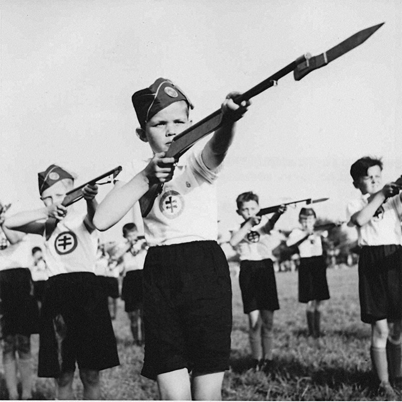
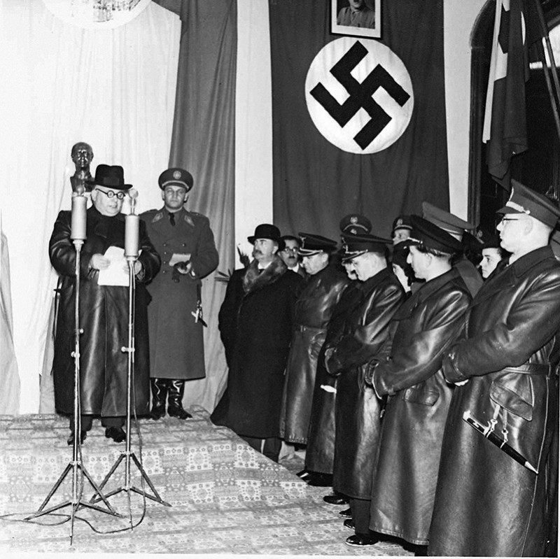
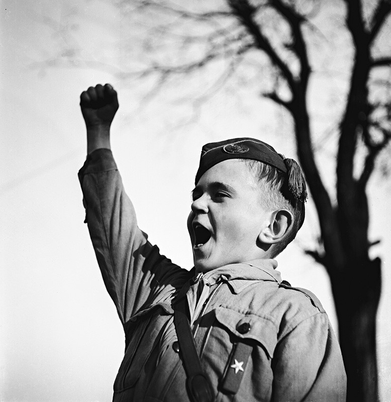
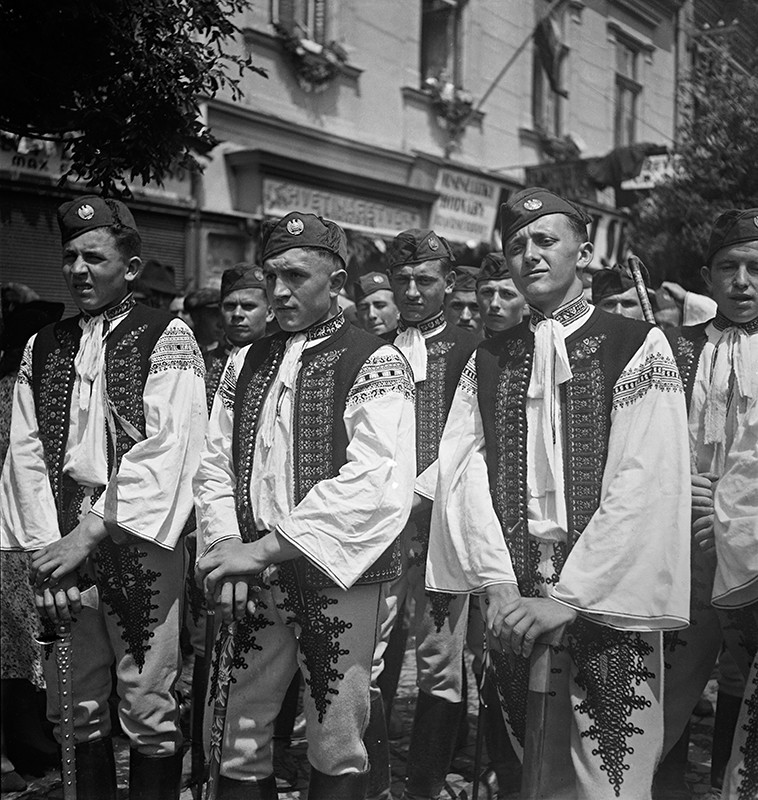
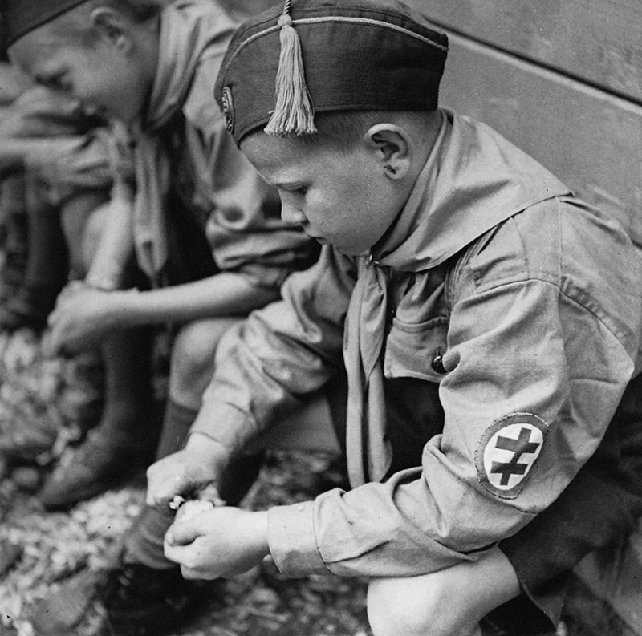
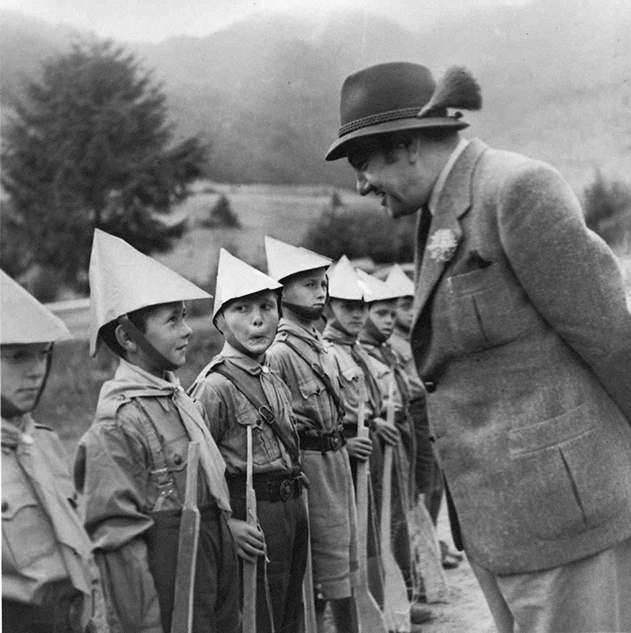
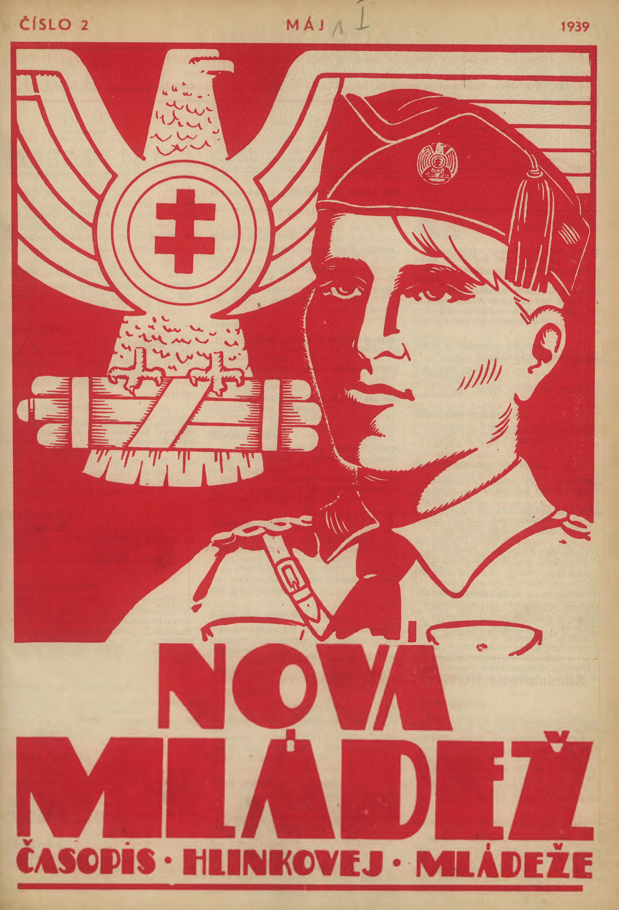

Podobne ako Hlinkova garda, aj Hlinkova mládež je organizáciou podriadenou HSĽS. Sformovala sa ako jednotná celoslovenská organizácia po rozpustení a nútenom zlúčení mládežníckych spolkov a organizácií v roku 1938. Spočiatku združuje len chlapcov, neskôr sa rozširuje aj o dievčenskú zložku. Jej symbolicky najvyšším veliteľom je tiež Jozef Tiso. Post hlavného veliteľa v rokoch 1940-1945 zastáva Alojz Macek. 

Členstvo v Hlinkovej mládeži je formálne dobrovoľné, no je zodpovedná za brannú výchovu a predvojenský výcvik pre všetkých občanov Slovenska vo veku 6-20 rokov (od roku 1940).

**Deň Hlinkovej mládeže v Bánovciach nad Bebravou, 1941:**
{% include 'partials/carousel.html.twig' with {
    'images': [
        {
            'src': 'http://www.webumenia.sk/images/diela/TMP/42/SVK_TMP.153/SVK_TMP.153.jpeg',
            'href': 'http://www.webumenia.sk/dielo/SVK:TMP.153?collection=83'
        },
		{
            'src': 'http://www.webumenia.sk/images/diela/TMP/46/SVK_TMP.157/SVK_TMP.157.jpeg',
            'href': 'http://www.webumenia.sk/dielo/SVK:TMP.157?collection=83'
        },
        {
            'src': 'http://www.webumenia.sk/images/diela/TMP/44/SVK_TMP.155/SVK_TMP.155.jpeg',
            'href': 'http://www.webumenia.sk/dielo/SVK:TMP.155?collection=83'
        },
        {
            'src': 'http://www.webumenia.sk/images/diela/TMP/45/SVK_TMP.156/SVK_TMP.156.jpeg',
            'href': 'http://www.webumenia.sk/dielo/SVK:TMP.156?collection=83'
        },
		{
            'src': 'http://www.webumenia.sk/images/diela/TMP/48/SVK_TMP.159/SVK_TMP.159.jpeg',
            'href': 'http://www.webumenia.sk/dielo/SVK:TMP.159?collection=83'
        }
    ]
}%}

## Dalšie médiá

