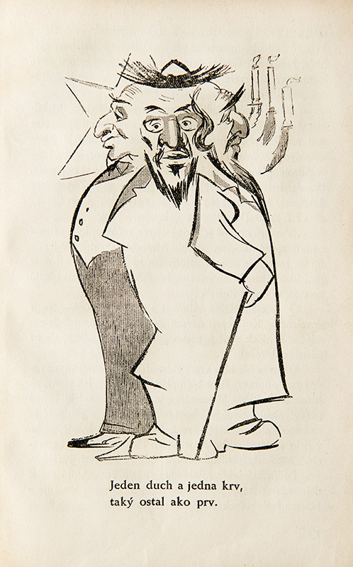

The term "Jew" was first defined by Slovak law in April 1939 in the regulation 63/1939. The populists redefined the term again in September 1941 in the Jewish Codex, this time according to racial principles.

#### The Codex decrees that:

A Jew, according to this regulation and irrespective of gender, is anyone:

a.) who has at least three grandparents who were ethnically Jewish;

b.) who is of mixed race and has two ethnically Jewish grandparents, if
- on 20 April 1939, they were still or later became a member of the Israelite (Jewish) faith,  
- after 20 April 1939, they entered into a marriage with a Jew (a.),
- they were born of a marriage with a Jew (a.) after 20 April 1939,
- they were born of an illegitimate relationship with a Jew (a.) after 20 February 1940.

