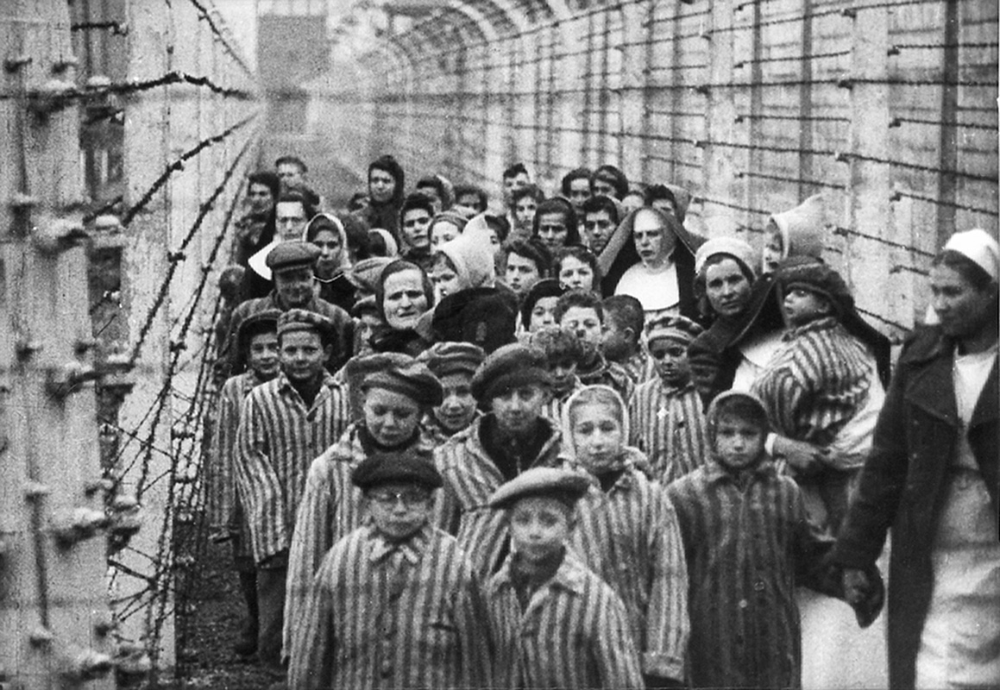
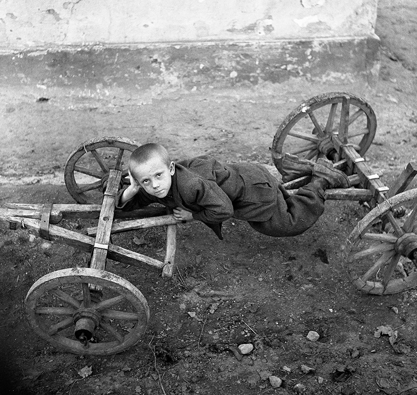

Holokaust (z gréc. holokauston - zápalná obeť) je všeobecný termín pre systematické, štátom-organizované prenasledovanie a zavraždenie šiestich miliónov Židov, vykonané nacistickým režimom a jeho kolaborantmi. Obeťou nacistických genocídnych plánov sa stali i ďalšie skupiny obyvateľstva, ktoré táto ideológia považovala za „podľudí“ – telesne a duševne postihnutí, homosexuáli, Rómovia a v miliónových počtoch aj Slovania. 

(zdroj: [INTRODUCTION TO THE HOLOCAUST](https://www.ushmm.org/wlc/en/article.php?ModuleId=10005143), United States Holocaust Memorial Museum, )

**Viliam Malík - Z cyklu repatrianti.:**
{% include 'partials/carousel.html.twig' with {
    'images': [
        {
            'src': 'http://www.webumenia.sk/images/diela/TMP/77/SVK_TMP.248/SVK_TMP.248.jpeg',
            'href': 'http://www.webumenia.sk/dielo/SVK:TMP.248?collection=86'
        },
		{ 
			'src': 'http://www.webumenia.sk/images/diela/TMP/75/SVK_TMP.246/SVK_TMP.246.jpeg',
            'href': 'http://www.webumenia.sk/dielo/SVK:TMP.246?collection=86'
        },
		{ 
			'src': 'http://www.webumenia.sk/images/diela/TMP/76/SVK_TMP.247/SVK_TMP.247.jpeg',
            'href': 'http://www.webumenia.sk/dielo/SVK:TMP.247?collection=86'
        }
    ]
}%}

