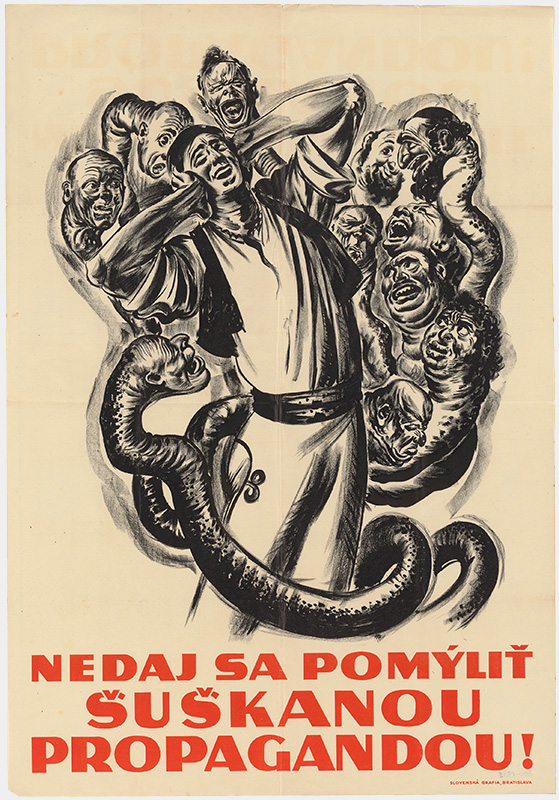
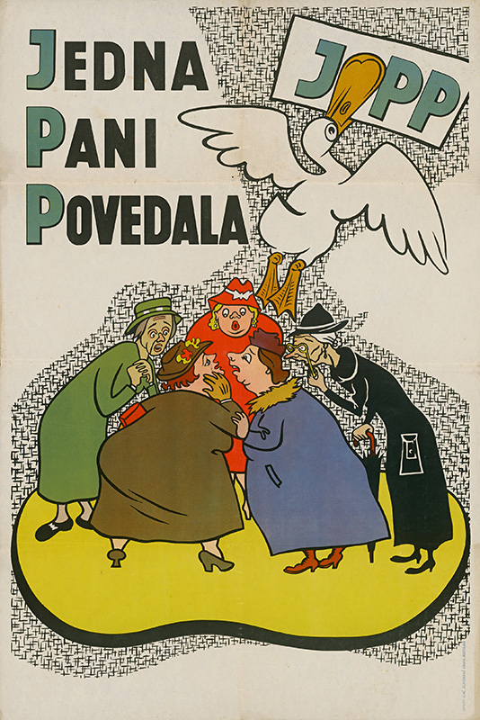

Propaganda (From Latin 'propagare' meaning 'to spread' or 'to propagate') is a deliberate spreading of information, often biased or misleading, with the aim to purposefully change or affirm the opinion of the public. In the era of the Slovak State, the regime used all known media for propaganda - radio, film, newspapers, magazines but also village message boards and local information points.

{% include 'partials/carousel.html.twig' with {
	'images': [
    	{
        	'title':'Book Cover Design for Josef Goebbels: Propaganda',
        	'src': 'https://www.webumenia.sk/images/diela/TMP/39/SVK_TMP.231/SVK_TMP.231.jpeg',
        	'href': 'https://www.webumenia.sk/dielo/SVK:TMP.231?collection=86'
    	},
   	 {
        	'title':'Flyer for the Formation Magazine',
   		 'src': 'https://www.webumenia.sk/images/diela/TMP/41/SVK_TMP.233/SVK_TMP.233.jpeg',
        	'href': 'https://www.webumenia.sk/dielo/SVK:TMP.233?collection=86'
    	},
   	 {
        	'title':'Flyer for the Formation Magazine',
   		 'src': 'https://www.webumenia.sk/images/diela/TMP/42/SVK_TMP.234/SVK_TMP.234.jpeg',
        	'href': 'https://www.webumenia.sk/dielo/SVK:TMP.234?collection=86'
    	}
	]
}%}

Monitoring of the information channels was a task for the Propaganda Office, created according to the German model and managed under the supervision of German consultants. One of the basic tools of propaganda is the creation of an image of the enemy. In the case of the Slovak State, this meant the image of the "eternal" Jew who will "never change" and who is constantly plotting to take over the world.

Anti-Semitic propaganda, which served as a cover for Hitler's own aggressive politics, was presented to the Slovak people during the deportations on a daily basis in various forms - through print, radio, newsreels shown before movies, posters, flyers but also stickers on bags of flour and sugar.

In response to developments in the war, the Jewish enemy was joined by several other stereotypical enemies (Czechs, Bolsheviks, rich upstarts, insurgents...).

**Caricatures from the Populist Newspaper**
{% include 'partials/carousel.html.twig' with {
	'images': [
    	{
        	'src': 'https://www.webumenia.sk/images/diela/TMP/38/SVK_TMP.230/SVK_TMP.230.jpeg',
        	'href': 'https://www.webumenia.sk/dielo/SVK:TMP.230?collection=86'
    	},
   	 {
   		 'src': 'https://www.webumenia.sk/images/diela/TMP/16/SVK_TMP.229/SVK_TMP.229.jpeg',
        	'href': 'https://www.webumenia.sk/dielo/SVK:TMP.229?collection=86'
    	},
    	{
   		 'src': 'https://www.webumenia.sk/images/diela/TMP/14/SVK_TMP.227/SVK_TMP.227.jpeg',
        	'href': 'https://www.webumenia.sk/dielo/SVK:TMP.227?collection=86'
    	},
    	{
        	'src': 'https://www.webumenia.sk/images/diela/TMP/15/SVK_TMP.228/SVK_TMP.228.jpeg',
        	'href': 'https://www.webumenia.sk/dielo/SVK:TMP.228?collection=86'
        	},
    	{
        	'src': 'https://www.webumenia.sk/images/diela/TMP/12/SVK_TMP.225/SVK_TMP.225.jpeg',
        	'href': 'https://www.webumenia.sk/dielo/SVK:TMP.225?collection=86'
        	},
    	{
        	'src': 'https://www.webumenia.sk/images/diela/TMP/13/SVK_TMP.226/SVK_TMP.226.jpeg',
        	'href': 'https://www.webumenia.sk/dielo/SVK:TMP.226?collection=86'
              	},
    	{
        	'src': 'https://www.webumenia.sk/images/diela/TMP/11/SVK_TMP.224/SVK_TMP.224.jpeg',
        	'href': 'https://www.webumenia.sk/dielo/SVK:TMP.224?collection=86'
              	},
    	{
        	'src': 'https://www.webumenia.sk/images/diela/TMP/10/SVK_TMP.223/SVK_TMP.223.jpeg',
        	'href': 'https://www.webumenia.sk/dielo/SVK:TMP.223?collection=86'
                    	},
    	{
        	'src': 'https://www.webumenia.sk/images/diela/TMP/8/SVK_TMP.221/SVK_TMP.221.jpeg',
        	'href': 'https://www.webumenia.sk/dielo/SVK:TMP.221?collection=86'
                    	},
    	{
        	'src': 'https://www.webumenia.sk/images/diela/TMP/9/SVK_TMP.222/SVK_TMP.222.jpeg',
        	'href': 'https://www.webumenia.sk/dielo/SVK:TMP.222?collection=86'
    	}
	]
}%}

News that did not align with the official account of events, was spread through alternative sources like foreign radio stations (mainly from London and Moscow), flyers and the so-called “whispering campaign”. A person could easily end up in Ilava internment camp on suspicion of spreading such information.

(Source: Dream x Reality Catalogue, Petra Hanáková text: Art - State - Propaganda, p51)