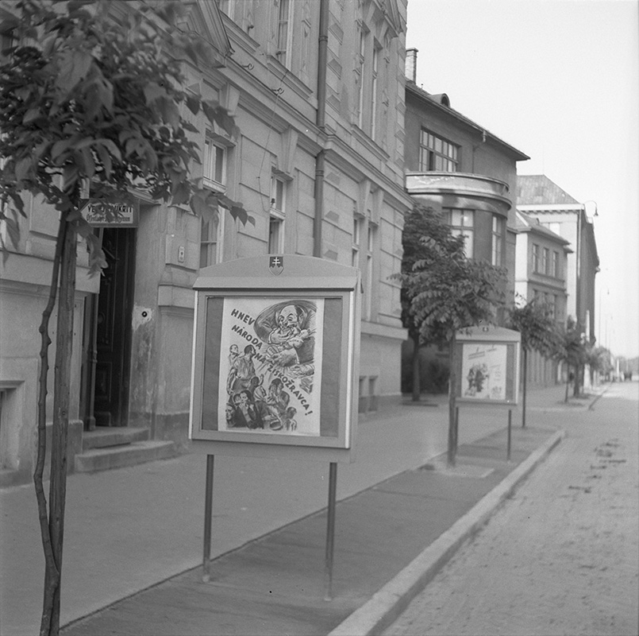
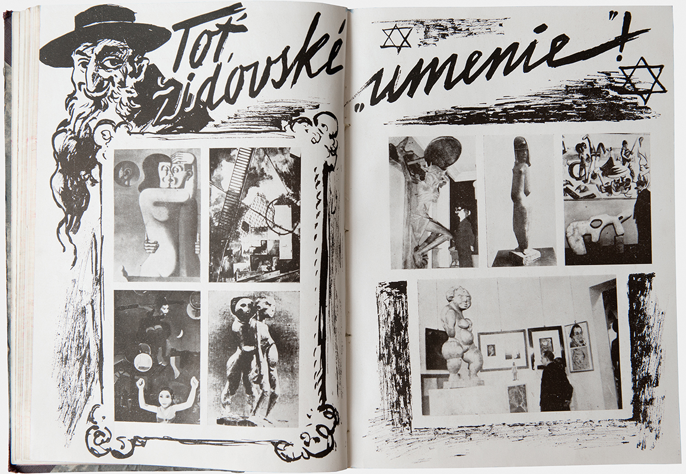

Propaganda (z latinského propagare – rozširovať) je šírenie informácií, často skreslených alebo deformovaných, s cieľom zámerne zmeniť alebo posilniť názor či postoj prijímateľa. V období slovenského štátu využíva režim na propagandistické účely prakticky všetky dostupné médiá – rozhlas, film, noviny a časopisy, ale napríklad aj dedinské vývesky, teda lokálne informačné body na vylepovanie tlačovín.

{% include 'partials/carousel.html.twig' with {
    'images': [
        {
            'title':'Návrh obálky pre knihu: Josef Goebbels: Propaganda', 
            'src': 'http://www.webumenia.sk/images/diela/TMP/39/SVK_TMP.231/SVK_TMP.231.jpeg',
            'href': 'http://www.webumenia.sk/dielo/SVK:TMP.231?collection=86'
        },
		{ 
            'title':'Leták týždenníka Nástup', 
			'src': 'http://www.webumenia.sk/images/diela/TMP/41/SVK_TMP.233/SVK_TMP.233.jpeg',
            'href': 'http://www.webumenia.sk/dielo/SVK:TMP.233?collection=86'
        },
		{ 
            'title':'Leták týždenníka Nástup', 
			'src': 'http://www.webumenia.sk/images/diela/TMP/42/SVK_TMP.234/SVK_TMP.234.jpeg',
            'href': 'http://www.webumenia.sk/dielo/SVK:TMP.234?collection=86'
        }
    ]
}%}

Usmerňovanie informačných kanálov je úlohou špecializovaného Úradu propagandy, vytvoreného podľa nemeckého vzoru a fungujúceho pod dozorom nemeckých poradcov. Jedným zo základných nástrojov propagandy je vytváranie obrazu nepriateľa. V prípade slovenského štátu k hlavným motívom patrí tzv. „večný“ Žid, ktorý sa „nikdy nezmení“ a neustále spriada sprisahanie, ktorým chce ovládnuť svet. 

Protižidovská propaganda, ktorou Hitler prekrýva vlastnú agresívnu politiku, je slovenskému národu v časoch deportácií servírovaná v najrôznejších podobách a na dennej báze – prostredníctvom tlače, rozhlasu, kinožurnálov premietaných pred filmami v kinách, plagátov, letákov, ale aj nálepiek na baleniach múky či cukru. 

V závislosti od aktuálneho vývoja geopolitickej situácie k židovskému nepriateľovi priebežne pribúda a odbúda niekoľko ďalších stereotypných nepriateľov (Čech, boľševik, zbohatlík, rozvratník...).

**Karikatúry z nástenných Ľudových novín**
{% include 'partials/carousel.html.twig' with {
    'images': [
        {
            'src': 'http://www.webumenia.sk/images/diela/TMP/38/SVK_TMP.230/SVK_TMP.230.jpeg',
            'href': 'http://www.webumenia.sk/dielo/SVK:TMP.230?collection=86'
        },
		{ 
			'src': 'http://www.webumenia.sk/images/diela/TMP/16/SVK_TMP.229/SVK_TMP.229.jpeg',
            'href': 'http://www.webumenia.sk/dielo/SVK:TMP.229?collection=86'
        },
        {
			'src': 'http://www.webumenia.sk/images/diela/TMP/14/SVK_TMP.227/SVK_TMP.227.jpeg',
            'href': 'http://www.webumenia.sk/dielo/SVK:TMP.227?collection=86'
        },
        {
            'src': 'http://www.webumenia.sk/images/diela/TMP/15/SVK_TMP.228/SVK_TMP.228.jpeg',
            'href': 'http://www.webumenia.sk/dielo/SVK:TMP.228?collection=86'
            },
        {
            'src': 'http://www.webumenia.sk/images/diela/TMP/12/SVK_TMP.225/SVK_TMP.225.jpeg',
            'href': 'http://www.webumenia.sk/dielo/SVK:TMP.225?collection=86'
            },
        {
            'src': 'http://www.webumenia.sk/images/diela/TMP/13/SVK_TMP.226/SVK_TMP.226.jpeg',
            'href': 'http://www.webumenia.sk/dielo/SVK:TMP.226?collection=86'
                  },
        {
            'src': 'http://www.webumenia.sk/images/diela/TMP/11/SVK_TMP.224/SVK_TMP.224.jpeg',
            'href': 'http://www.webumenia.sk/dielo/SVK:TMP.224?collection=86'
                  },
        {
            'src': 'http://www.webumenia.sk/images/diela/TMP/10/SVK_TMP.223/SVK_TMP.223.jpeg',
            'href': 'http://www.webumenia.sk/dielo/SVK:TMP.223?collection=86'
                        },
        {
            'src': 'http://www.webumenia.sk/images/diela/TMP/8/SVK_TMP.221/SVK_TMP.221.jpeg',
            'href': 'http://www.webumenia.sk/dielo/SVK:TMP.221?collection=86'
                        },
        {
            'src': 'http://www.webumenia.sk/images/diela/TMP/9/SVK_TMP.222/SVK_TMP.222.jpeg',
            'href': 'http://www.webumenia.sk/dielo/SVK:TMP.222?collection=86'
        }
    ]
}%}

Alternatívnymi cestami, ktorými sa šíria správy nekorešpondujúce s oficiálnou verziou skutočnosti, sú zahraničné rozhlasové stanice (najmä Londýn a Moskva), letáky a tzv. šuškaná propaganda. Za podozrenie zo šírenia takýchto správ sa človek ľahko dostane rovno do Ilavy.

[")](http://www.webumenia.sk/dielo/SVK:TMP.220?collection=86)

(zdroj informácií: zborník k výstave Sen x skutočnosť, text Petry Hanákovej: Umenie – štát – propaganda, s. 51)