## Obrat vo vojne a kríza ľudáckeho režimu

Z   ačiatkom roku 1943 vyvrcholila niekoľkomesačná bitka o Stalingrad porážkou nacistických vojsk. Situácia na východnom fronte sa začína vyvíjať v neprospech Tretej ríše a jej spojencov. 

[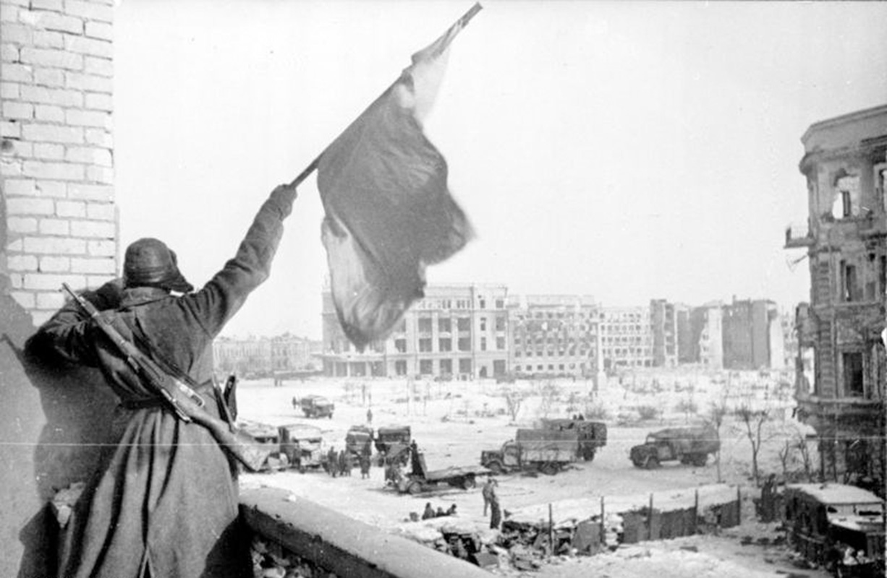](https://upload.wikimedia.org/wikipedia/commons/2/29/Bundesarchiv_Bild_183-W0506-316%2C_Russland%2C_Kampf_um_Stalingrad%2C_Siegesflagge.jpg)

Pred útočiacou Červenou armádou ustupuje aj slovenská Rýchla divízia. Keďže pritom stráca časť výzbroje a materiálu, fakticky prichádza o charakter motorizovaného útvaru. Na požiadavky Slovákov o prezbrojenie a doplnenie výstroja a koní slovenských jednotiek Nemci dávajú len neurčité sľuby. Množia sa dezercie slovenských vojakov zo slovenskej Zaisťovacej divízie a ich prechody na sovietsku stranu.

**Jozef Cincík - Fotografie slovenskej armády na východe **
{% include 'partials/carousel.html.twig' with {
    'images': [
        {
            'title':'Slovenskí vojaci v čase voľna na východnom fronte - Veselý rozhovor s veliteľom', 
            'src': 'http://www.webumenia.sk/images/diela/TMP/67/SVK_TMP.275/SVK_TMP.275.jpeg',
            'href': 'http://www.webumenia.sk/dielo/SVK:TMP.275?collection=88'
        },
		{ 
            'title':'Slovenskí a nemeckí vojaci pri zábave', 
			'src': 'http://www.webumenia.sk/images/diela/TMP/66/SVK_TMP.274/SVK_TMP.274.jpeg',
            'href': 'http://www.webumenia.sk/dielo/SVK:TMP.274?collection=88'
        },
        {
             'title':'Šumenie klasov spieva pohrebnú pieseň padlému hrdinovi', 
            'src': 'http://www.webumenia.sk/images/diela/TMP/68/SVK_TMP.276/SVK_TMP.276.jpeg',
            'href': 'http://www.webumenia.sk/dielo/SVK:TMP.276?collection=88'
        },
        {
            'title':'Z vojny v ZSSR - Naklonený betónový mlyn v meste Pologi', 
            'src': 'http://www.webumenia.sk/images/diela/TMP/64/SVK_TMP.272/SVK_TMP.272.jpeg',
            'href': 'http://www.webumenia.sk/dielo/SVK:TMP.272?collection=88'
            },
        {
            'title':'Postup rýchlej brigády na Ukrajine', 
            'src': 'http://www.webumenia.sk/images/diela/TMP/65/SVK_TMP.273/SVK_TMP.273.jpeg',
            'href': 'http://www.webumenia.sk/dielo/SVK:TMP.273?collection=88'
            },
    ]
}%}

Minister národnej obrany gen. Čatloš už na jar 1943 usiluje o stiahnutie slovenských vojakov z východného frontu a ich presun na iné územie pod kontrolou Ríše. Nemci to odmietajú a Zaisťovacia divízia je na konci júna 1943 presunutá z Ukrajiny do priestoru Minska v Bielorusku. Pod tlakom nepriaznivého vývoja na fronte tu potrebujú každého bojaschopného vojaka. Následná porážka nemeckých vojsk pri Kursku definitívne spečaťuje obrat na východnom fronte. Od tejto chvíle už nasleduje len ústup Nemecka a jeho spojencov, ktorý nacistická propaganda prezentuje ako „strategický ústup“.

[.jpg "Friedrich Zschäckel - Bitka pri Kursku - nemeckí vojaci na ústupe, jún 1943, Bundesarchiv, BArch")](https://upload.wikimedia.org/wikipedia/commons/a/a0/Bundesarchiv_Bild_101III-Zschaeckel-206-35%2C_Schlacht_um_Kursk%2C_Panzer_VI_%28Tiger_I%29.jpg)

V júli 1943 sa uskutočňuje invázia západných spojencov na Sicílii. Po reorganizácii je od 1. augusta 1943 Rýchla divízia premenovaná na 1. pešiu divíziu a Zaisťovacia divízia zasa na 2. pešiu divíziu. Slovenská vláda sa márne dožaduje, aby o nasadení slovenských jednotiek na východnom fronte spolurozhodovalo slovenské ministerstvo národnej obrany. Aj pokusy presadiť, aby divízie plnili len zaisťovacie úlohy a boli pod jednotným velením, Nemci vnímajú ako príznak pochybností „ohľadom nemeckého konečného víťazstva.“ 

V októbri 1943 sú jednotky 2. pešej divízie reorganizované a presunuté do Talianska. Na konci mesiaca padlo pri ukrajinskom Melitopole do zajatia aj vyše 2 tisíc príslušníkov 1. pešej divízie, pričom časť z nich sama prešla na sovietsku stranu. Rozklad jednotky pokračuje aj v ďalších mesiacoch a 1. júna 1944 je napokon premenovaná na technickú divíziu a reorganizovaná do podoby pracovného útvaru. 

O skutočnej situácii na frontoch sa slovenská verejnosť dozvedá z viacerých zdrojov. Očité svedectvá o „úspešnom ťažení“ aj o „strategickom ústupe nemeckej armády“ prinášajú vojnoví navrátilci. 

Slovenskí robotníci v Nemecku už zažívajú bombardovanie priemyselných cieľov na vlastnej koži. Zdrojom ďalších informácií je tajné počúvanie moskovského a londýnskeho rozhlasu. Spojeneckí predstavitelia ním opakovane potvrdzujú svoje uznanie exilovej československej vlády. Vie sa, že Slováci bojujú v československých jednotkách v Sovietskom zväze aj vo Veľkej Británii. V septembri 1943 vo verejnej mienke rezonuje už aj kapitulácia Talianska. 

Do konca roka 1943 sa ľudácky režim ocitá vo vnútornej kríze. Je zrejmé, že blížiaca sa porážka Tretej ríše bude znamenať aj jeho koniec. To si uvedomujú aj mnohí pracovníci bezpečnostného aparátu a príslušníci slovenskej armády. Najaktívnejšia a najvplyvnejšia je skupina dôstojníkov, zoskupená okolo štyroch podplukovníkov: Jána Goliana, Mikuláša Ferjenčíka, Mirka Vesela a Dezidera Kišša-Kalinu. Ako dôstojníci z povolania chcú svoju ilegálnu činnosť viesť podľa direktív riadneho exilového vedenia – prezidenta E. Beneša a Ministerstva národnej obrany v Londýne. Vo februári 1944 posielajú do Londýna optimisticky nadsadenú správu o zjednotení vojenského odboja. Prezident Beneš poveruje dočasným vedením vojenských akcií pplk. Jána Goliana.

Nemecké bojové neúspechy mobilizujú aj dovtedy nejednotné civilné odbojové prúdy na Slovensku a podnecujú ich k spolupráci.

Podporuje ju aj zmena línie komunistického hnutia. Kým pred vojnou podľa príkazu z Moskvy komunisti zatracovali ešte aj sociálnych demokratov ako nepriateľov, teraz majú vytvárať spoločné „národné fronty“ so všetkými protinacistickými „buržoáznymi“ silami. Na konci roku 1943 nachádzajú slovenskí komunisti spoločnú reč s predstaviteľmi občianskeho odboja okolo Jozefa Lettricha a Jána Ursínyho a vytvárajú ilegálnu Slovenskú národnú radu – spoločný orgán odboja. Začína sa nová etapa, ktorej hlavným cieľom je príprava ozbrojeného povstania.

Ján Golian vedie ilegálne Vojenské ústredie, ktoré pracuje na pláne povstania. Ideálny variant počíta s nasadením „Poľnej armády“ (zloženej z 2 divízií) na východnom Slovensku. Tieto jednotky majú uvoľniť Červenej armáde prechod cez karpatské priesmyky v priestore Bardejova a Medzilaboriec. Ostatné posádky na Slovensku (Zápoľná armáda) majú zaistiť priestor stredného Slovenska, plánovite vykonať prevrat a mobilizáciu, po doplnení stavu sa spojiť s Poľnou armádou a spoločne so sovietskymi vojskami poraziť Nemcov. V prípade, ak by nacisti začali s okupáciou Slovenska skôr, sa má podľa núdzového variantu plánu začať s ozbrojeným odporom ihneď, bez ohľadu na stav príprav povstania.

Dňa 16. júna 1944 sa bratislavská ropná rafinéria Apollo, ako jeden zo strategických podnikov pre Nemecko, stáva terčom amerického bombardovania. „Nemecká ochranná ruka“ je už len prázdnym heslom. Vojna vstupuje priamo na slovenské územie. 

[")](http://www.webumenia.sk/dielo/SVK:SNG.UP-DK_4488)

**Pavol Poljak - Bratislava. Rafinéria Apollo a prístav po bombardovaní I.- VII.**
{% include 'partials/carousel.html.twig' with {
    'images': [
        {
            'title':'I.', 
            'src': 'http://www.webumenia.sk/images/diela/SNG/15/SVK_SNG.UP-DK_2542/SVK_SNG.UP-DK_2542.jpeg',
            'href': 'http://www.webumenia.sk/dielo/SVK:SNG.UP-DK_2542'
        },
		{ 
            'title':'II.', 
			'src': 'http://www.webumenia.sk/images/diela/SNG/16/SVK_SNG.UP-DK_2543/SVK_SNG.UP-DK_2543.jpeg',
            'href': 'http://www.webumenia.sk/dielo/SVK:SNG.UP-DK_2543'
        },
        {
             'title':'III.', 
            'src': 'http://www.webumenia.sk/images/diela/SNG/17/SVK_SNG.UP-DK_2544/SVK_SNG.UP-DK_2544.jpeg',
            'href': 'http://www.webumenia.sk/dielo/SVK:SNG.UP-DK_2544'
        },
        {
            'title':'IV.', 
            'src': 'http://www.webumenia.sk/images/diela/SNG/18/SVK_SNG.UP-DK_2545/SVK_SNG.UP-DK_2545.jpeg',
            'href': 'http://www.webumenia.sk/dielo/SVK:SNG.UP-DK_2545'
            },
        {
            'title':'V.', 
            'src': 'http://www.webumenia.sk/images/diela/SNG/19/SVK_SNG.UP-DK_2546/SVK_SNG.UP-DK_2546.jpeg',
            'href': 'http://www.webumenia.sk/dielo/SVK:SNG.UP-DK_2546'
            },
            {
              'title':'VI.', 
            'src': 'http://www.webumenia.sk/images/diela/SNG/20/SVK_SNG.UP-DK_2547/SVK_SNG.UP-DK_2547.jpeg',
            'href': 'http://www.webumenia.sk/dielo/SVK:SNG.UP-DK_2547'
            },
        {
             'title':'VII.', 
            'src': 'http://www.webumenia.sk/images/diela/SNG/21/SVK_SNG.UP-DK_2548/SVK_SNG.UP-DK_2548.jpeg',
            'href': 'http://www.webumenia.sk/dielo/SVK:SNG.UP-DK_2548'
        }
    ]
}%}



---

## Slovenské národné povstanie
### 29. 8. 1944 {.title-date}

Jedným z prejavov silnejúcich opozičných nálad v slovenskej spoločnosti je rozšírenie partizánskeho hnutia. Partizánske skupiny tvoria odporcovia režimu, perzekvované osoby či bývalí vojaci slovenskej armády. Sú v nich aj vojaci sovietskej armády, ktorým sa podarilo utiecť z nemeckého zajatia. Silný impulz pre vzrast partizánskych aktivít prinášajú výsadky sovietskych organizátorských skupín v lete 1944.

V novinách Gardista ešte 6. augusta podpredseda vlády Alexander Mach priznáva existenciu „niekoľkých malých skupiniek zo zahraničia“, ktoré sa podarilo „vyhnať alebo zajať“, a upokojuje verejnosť, že „vážneho partizánskeho nebezpečenstva u nás niet“. Pritom však vláda znepokojená vývojom a hláseniami o akciách partizánov nasadzuje proti nim 10. augusta 1944 armádu v priestore Nízkych Tatier a Veľkej Fatry. 

Vláda vyhlasuje 11. augusta 1944 na celom území Slovenska stanné právo (štatárium). To umožňuje v skrátenom konaní pred „stannými súdmi“ udeľovať sprísnené tresty, vrátane trestov smrti. Rozkladajúci sa režim však už ani takto nedokáže zastaviť silnejúce hnutie odporu. V auguste je v slovenských horách niekoľko tisíc partizánov a ťažisko ich aktivít sa sústreďuje na strednom Slovensku. 

[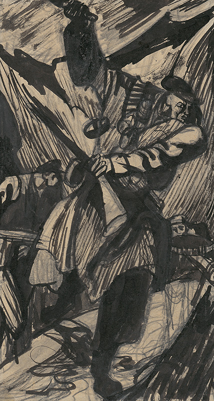](http://www.webumenia.sk/dielo/SVK:SNG.K_4707?collection=88)

Činnosť jednotlivých partizánskych skupín však nie je dostatočne koordinovaná s aktivitou Vojenského ústredia. Partizáni vedení sovietskymi dôstojníkmi zatarasujú tunely, prepadávajú zásobovacie sklady a koncom mesiaca už dokonca neváhajú obsadiť aj niektoré obce. V obci Sklabiňa verejne vyhlasujú 21. 8. 1944 Československú republiku. O niekoľko dní neskôr, 26. augusta, oslobodia politických väzňov v Ružomberku a na druhý deň obsadzujú s vojakmi mesto. 

Odbojová nálada narastá a atmosféra na strednom Slovensku vrie. Partizáni sa púšťajú aj do násilných akcií proti civilnému obyvateľstvu nemeckej národnosti, regionálnym ľudáckym funkcionárom a nemeckým dôstojníkom, ktorí prechádzajú Slovenskom. Niekde sa pod vplyvom sovietskych partizánskych veliteľov pridávajú k ich akciám aj vojaci. Dňa 28. augusta dôjde v martinskej vojenskej posádke k zastreleniu zajatej skupiny nemeckých vojakov a diplomatov. Svojím konaním tak sovietski partizánski velitelia urýchľujú rozhodnutie Tretej ríše o okupácii Slovenskej republiky. 

Nemci, ktorí dlhodobo sledujú aktivitu partizánov na Slovensku, sa rozhodnú konať a 29. augusta 1944 prichádzajú na naše územie okupačné jednotky. Vojenské ústredie je nútené postupovať podľa núdzového variantu a v ten istý večer rozosiela pplk. Ján Golian vojenským posádkam šifrovaný pokyn „Začnite s vysťahovaním“, vyzývajúci začať ozbrojený odpor. Ďalší deň sa už do mobilizácie armády aj verejnosti zapája Slobodný vysielač z Banskej Bystrice. Začína sa Slovenské národné povstanie. 

[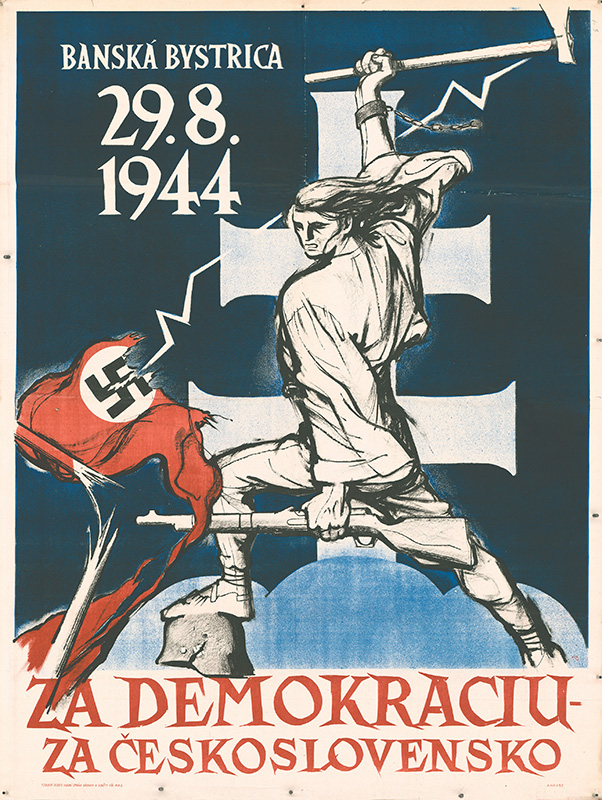](http://www.webumenia.sk/dielo/SVK:TMP.284?collection=88)

Prejavuje sa nedostatočná koordinácia odboja a Nemci odzbrojujú dve východoslovenské divízie, ako aj bratislavskú vojenskú posádku. Povstalci ovládajú len územie stredného Slovenska a centrom povstania je Banská Bystrica. Tu padá režim HSĽS, povstalecká Slovenská národná rada zakazuje nielen činnosť tejto strany, ale spolu s činnosťou Hlinkovej gardy a Hlinkovej mládeže pochopiteľne rozpúšťa aj nemeckú či maďarskú stranu. Povstanie sa hlási k existencii demokratickej Československej republiky a jeho bojovníci sú súčasťou jej ozbrojených síl. 

Zásobovanie povstaleckej armády a obyvateľstva zabezpečujú zásoby a peniaze nahromadené na strednom Slovensku od júna 1944, ktoré sem sústredili pod rôznymi zámienkami pracovníci ústredných štátnych orgánov, spolupracujúci s odbojom, ako napríklad guvernér Slovenskej národnej banky Imrich Karvaš (ktorý bol súčasne prednostom Najvyššieho úradu pre zásobovanie) a jeho kolegovia. Finančnú pomoc odboju poskytujú Baťove závody, Micherova továreň v Starej Turej a ďalšie podniky. Podstatným dielom prispievajú tiež veľkostatky a podniky na oslobodenom území, vrátane Podbrezovských železiarní či Železničných opravovní vo Zvolene, kde sa pre povstalcov urýchlene vyrábajú tri pancierové vlaky. 

[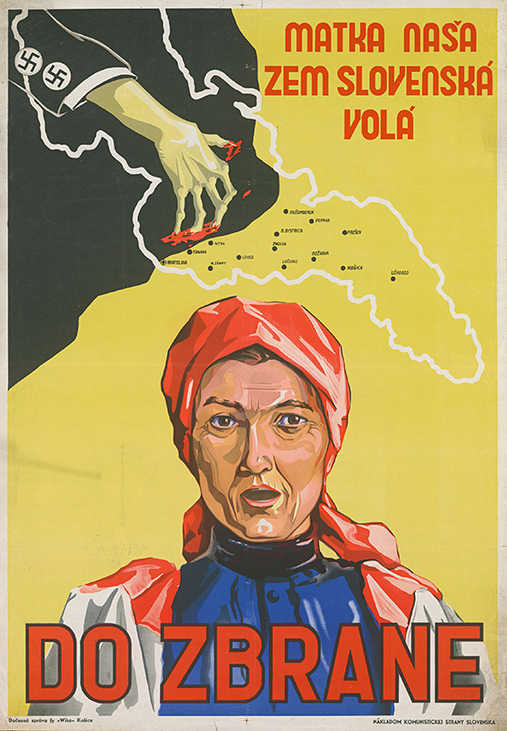](http://www.webumenia.sk/dielo/SVK:TMP.282?collection=88)

Povstalecká 1. československá armáda na Slovensku disponuje spočiatku asi 18 000 vojakmi. Po mobilizácii z 5. septembra 1944 stúpa ich počet na takmer 50 000. Majú však nedostatok výzbroje, často zastaranej, a aj nedostatočné bojové skúsenosti. Prvým veliteľom povstalcov sa v neľahkej situácii stáva generál Ján Golian, jeden zo spolutvorcov vojenského plánu povstania. 

Nemecké jednotky útočia na územie pod kontrolou povstalcov z viacerých smerov. Na západnom Slovensku nasadili 9 000 vojakov a na východe operovalo asi 15 000 vojakov. Na niektorých miestach ich podporuje miestne nemecké obyvateľstvo. Povstalecká armáda a partizáni za značných strát odrážajú nacistické útoky a na niektorých úsekoch sa Nemcom nedarí presadiť napriek vlastným očakávaniam bleskového úspechu. 

V Slovenskom národnom povstaní bojujú po boku Slovákov a Čechov aj príslušníci ďalších 30 národov a národností. Sú medzi nimi výsadkári zo spojeneckých armád aj utečenci zo zajateckých a koncentračných táborov.

 
Dňa 6. októbra je za veliteľa povstaleckej armády menovaný divízny generál Rudolf Viest. V druhej polovici septembra 1944 sa povstalecká obrana upevňuje, no postup Nemcov sa napokon nepodarí zastaviť. Na pomoc povstaniu je zo ZSSR presunutá 2. československá paradesantná brigáda a 1. čs. stíhací pluk. Materiálnu pomoc posielajú aj Spojené štáty. 

{% include 'partials/carousel.html.twig' with {
    'images': [
        {
            'title':'Štefan Bednár - Smrť nacizmu!', 
            'src': 'http://www.webumenia.sk/images/diela/TMP/98/SVK_TMP.285/SVK_TMP.285.jpeg',
            'href': 'http://www.webumenia.sk/dielo/SVK:TMP.285?collection=88'
        },
		{ 
            'title':'Štefan Bednár - Banská Bystrica', 
			'src': 'http://www.webumenia.sk/images/diela/SNG/49/SVK_SNG.G_1851/SVK_SNG.G_1851.jpeg',
            'href': 'http://www.webumenia.sk/dielo/SVK:SNG.G_1851?collection=88'
        },
        {
             'title':'Štefan Bednár - „Priepustka“', 
            'src': 'http://www.webumenia.sk/images/diela/TMP/43/SVK_TMP.316/SVK_TMP.316.jpeg',
            'href': 'http://www.webumenia.sk/dielo/SVK:TMP.316?collection=88'
        },
    ]
}%}

Presila je však príliš veľká. Keď v októbri začnú nemeckí okupanti generálnu ofenzívu, povstanie ich tlaku podľahne. Dňa 27. októbra 1944 vydáva generál Viest rozkaz na ústup z Banskej Bystrice na Donovaly a zakrátko rozpúšťa povstaleckú armádu, ktorá prechádza na partizánsky spôsob boja, aby mohla uniknúť nemeckému zajatiu a naďalej viesť ozbrojený odpor.
Začiatkom novembra 1944 však padli po akcii nacistického Einsatzkommanda 14 do zajatia povstaleckí velitelia Rudolf Viest a Ján Golian so sprievodom.

<figure class="audio" markdown="1">

<figcaption><a href="http://www.memoryofnations.eu/witness/clip/id/5203/clip/14235">Branislav Tvarožek (1925) - Golianova a Viestova ochranná divízia, Príbehy 20. storočia, Post Bellum SK</a></figcaption>
</figure>

Po vyšetrovaní gestapom sú postavení pred Mimoriadny súd SS a odsúdení na trest smrti. Ich stopa sa stráca v koncentračnom tábore Flossenbürg, kde s veľkou pravdepodobnosťou došlo k vykonaniu rozsudku.



---
## Obete nemeckej okupácie

S nemeckými vojenskými jednotkami prichádzajú na Slovensko jednotky nemeckého bezpečnostného a represívneho aparátu. Západné a postupne aj stredné Slovensko sa stáva operačným priestorom Pohotovostnej skupiny H nemeckej bezpečnostnej polície (Sipo) a bezpečnostnej služby (SD) – Einsatzgruppe H der Sipo und des SD. Štáb skupiny sídli v Bratislave a jemu podriadené komandá sa rozmiestňujú po obsadzovanom území, kde zriaďujú svoje oporné body. 

Na východné Slovensko prichádzajú príslušníci Komanda Zbv 27, podriadeného veliteľovi nemeckej bezpečnostnej polície a bezpečnostnej služby v Krakove. Všetky tieto zložky majú v prvom rade vypátrať a pacifikovať osoby akokoľvek podporujúce povstanie a tiež zaistiť a  deportovať alebo zlikvidovať na mieste Židov, ktorí ešte prežili na Slovensku. Prezident Tiso ani rekonštruovaná slovenská vláda sa neprotivia, naopak, s nacistickým bezpečnostným aparátom spolupracujú.

[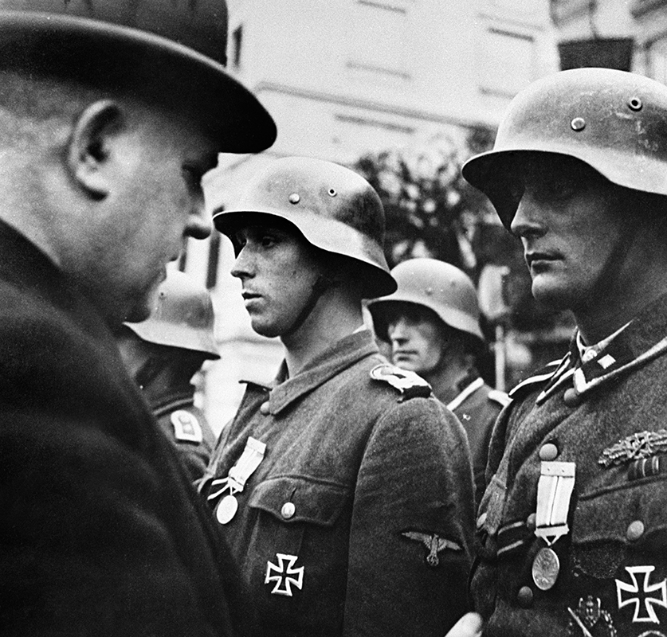](http://www.webumenia.sk/dielo/SVK:TMP.322)

Po faktickom rozklade vlastnej armády ľudácky režim vytvára Pohotovostné oddiely Hlinkovej gardy (POHG) a poľné roty HG, ktoré sú poskytnuté k dispozícii veliteľom jednotlivých nemeckých kománd. Vznikajú tiež pohotovostné jednotky Hlinkovej mládeže.

[")](http://digitalna.kniznica.info/zoom/31090/view?page=35&p=separate&view=0,0,1731,2635)

Nacisti aj ich slovenskí kolaboranti zatýkajú stovky osôb. Väznia ich na rôznych miestach, kde ich vypočúvajú, týrajú a často aj popravujú.
Po vojenskej porážke Slovenského národného povstania je civilné obyvateľstvo Slovenska vystavené dovtedy nevídanému teroru. Napriek tomu poskytujú mnohí Slováci pomoc povstalcom ukrývajúcim sa v horách, niekedy doslova celým partizánskym oddielom. 

**František Nový - Prechod partizánskej brigády Pomstiteľ cez front. Odpočinok na ceste z Magurky na Chabenec**
{% include 'partials/carousel.html.twig' with {
    'images': [
        {
            'src': 'http://www.webumenia.sk/images/diela/TMP/31/SVK_TMP.297/SVK_TMP.297.jpeg',
            'href': 'http://www.webumenia.sk/dielo/SVK:TMP.297'
        },
		{ 
			'src': 'http://www.webumenia.sk/images/diela/TMP/30/SVK_TMP.296/SVK_TMP.296.jpeg',
            'href': 'http://www.webumenia.sk/dielo/SVK:TMP.296'
        },
        {
            'src': 'http://www.webumenia.sk/images/diela/TMP/29/SVK_TMP.295/SVK_TMP.295.jpeg',
            'href': 'http://www.webumenia.sk/dielo/SVK:TMP.295'
        },
        {
            'src': 'http://www.webumenia.sk/images/diela/TMP/28/SVK_TMP.294/SVK_TMP.294.jpeg',
            'href': 'http://www.webumenia.sk/dielo/SVK:TMP.294'
 }
    ]
}%}

Na pomoc slovenského obyvateľstva sú odkázaní aj Židia, ktorým už zostáva len posledná možnosť: ukryť sa v rôznych provizórnych úkrytoch. Každý, kto im pomáha, riskuje svoj život a neraz aj životy svojich blízkych. Židia, ktorí ešte v roku 1944 žijú na Slovensku a padnú do rúk nacistov a ich kolaborantov, sú buď deportovaní zo Slovenska, alebo popravení na jeho území. 

Nemci akýkoľvek náznak podpory partizánov alebo Židov kruto trestajú. Vypaľujú celé obce a organizujú hromadné popravy.

Najmä na strednom Slovensku, kde pôsobí Einsatzkommando 14 a s ním spolupracujúce oddiely slovenských gardistov, sú spáchané najväčšie zverstvá. Pri obci Kremnička sa obeťami nacistov stáva 747 partizánov, povstaleckých vojakov, Židov a Rómov, vrátane desiatok detí, nájdených po vojne vo viacerých masových hroboch. Vo vápenke pri obci Nemecká zavraždia nacisti a ich kolaboranti 400 až 900 osôb. 

[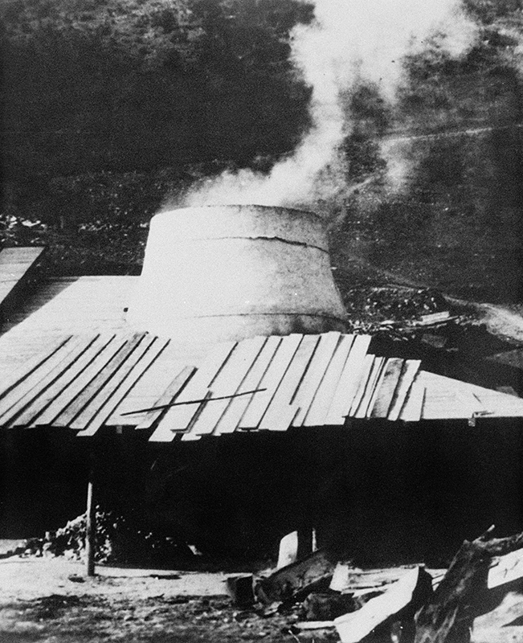](http://www.webumenia.sk/dielo/SVK:TMP.321?collection=88)

Ešte na konci októbra 1944 je nacistami prepadnutá obec Miezgovce, kde sú desiatky miestnych mužov  podrobené vypočúvaniu a mučeniu. Dňa 27. decembra, hneď po vianočných sviatkoch, nacisti v obci Medzibrod mučia a pred zrakmi miestnych obesia na šibenici trojicu slovenských a jedného sovietskeho partizána. 

V januári 1945 vypália spolu so slovenskými kolaborantmi obce Ostrý Grúň a Kľak, obeťami sa okrem niekoľkých partizánov stáva aj 148 civilistov. Obyvateľov obce Skýcov v polovici marca vyženú z domovov, obec vydrancujú a podpália. V marci potom ešte stihnú vypáliť aj obec Kalište. 

Útoky voči civilistom podnikajú aj niektorí partizáni, a to voči menšinovému nemeckému obyvateľstvu aj voči osobám slovenskej národnosti, ktoré považovali za kolaborantov. K najväčším zločinom zo strany povstalcov patrí masová poprava viac ako 180 obyvateľov (nemeckej národnosti) v obci Sklené v septembri 1944. 

**Nacistická evidencia zajatých slovenských vojakov pred ich popravou alebo odvlečením do koncentračných táborov**
{% include 'partials/carousel.html.twig' with {
    'images': [
        {
            'src': 'http://www.webumenia.sk/images/diela/TMP/6/SVK_TMP.300/SVK_TMP.300.jpeg',
            'href': 'http://www.webumenia.sk/dielo/SVK:TMP.300'
        },
		{ 
			'src': 'http://www.webumenia.sk/images/diela/TMP/41/SVK_TMP.314/SVK_TMP.314.jpeg',
            'href': 'http://www.webumenia.sk/dielo/SVK:TMP.314'
        },
        {
            'src': 'http://www.webumenia.sk/images/diela/TMP/40/SVK_TMP.313/SVK_TMP.313.jpeg',
            'href': 'http://www.webumenia.sk/dielo/SVK:TMP.313?collection=91'
        },
        {
            'src': 'http://www.webumenia.sk/images/diela/TMP/39/SVK_TMP.312/SVK_TMP.312.jpeg',
            'href': 'http://www.webumenia.sk/dielo/SVK:TMP.312?collection=91'
            },
        {
            'src': 'http://www.webumenia.sk/images/diela/TMP/14/SVK_TMP.308/SVK_TMP.308.jpeg',
            'href': 'http://www.webumenia.sk/dielo/SVK:TMP.308?collection=91'
              },
        {
            'src': 'http://www.webumenia.sk/images/diela/TMP/38/SVK_TMP.311/SVK_TMP.311.jpeg',
            'href': 'http://www.webumenia.sk/dielo/SVK:TMP.311?collection=91'
              },
        {
            'src': 'http://www.webumenia.sk/images/diela/TMP/37/SVK_TMP.310/SVK_TMP.310.jpeg',
            'href': 'http://www.webumenia.sk/dielo/SVK:TMP.310?collection=91'
              },
        {
            'src': 'http://www.webumenia.sk/images/diela/TMP/15/SVK_TMP.309/SVK_TMP.309.jpeg',
            'href': 'http://www.webumenia.sk/dielo/SVK:TMP.309?collection=91'
              },
        {
            'src': 'http://www.webumenia.sk/images/diela/TMP/10/SVK_TMP.304/SVK_TMP.304.jpeg',
            'href': 'http://www.webumenia.sk/dielo/SVK:TMP.304?collection=91'
              },
        {
            'src': 'http://www.webumenia.sk/images/diela/TMP/13/SVK_TMP.307/SVK_TMP.307.jpeg',
            'href': 'http://www.webumenia.sk/dielo/SVK:TMP.307?collection=91'
              },
        {
            'src': 'http://www.webumenia.sk/images/diela/TMP/11/SVK_TMP.305/SVK_TMP.305.jpeg',
            'href': 'http://www.webumenia.sk/dielo/SVK:TMP.305?collection=91'
              },
        {
            'src': 'http://www.webumenia.sk/images/diela/TMP/12/SVK_TMP.306/SVK_TMP.306.jpeg',
            'href': 'http://www.webumenia.sk/dielo/SVK:TMP.306?collection=91'
              },
        {
            'src': 'http://www.webumenia.sk/images/diela/TMP/42/SVK_TMP.315/SVK_TMP.315.jpeg',
            'href': 'http://www.webumenia.sk/dielo/SVK:TMP.315?collection=91'
              },
        {
            'src': 'http://www.webumenia.sk/images/diela/TMP/9/SVK_TMP.303/SVK_TMP.303.jpeg',
            'href': 'http://www.webumenia.sk/dielo/SVK:TMP.303?collection=91'
              },
        {
            'src': 'http://www.webumenia.sk/images/diela/TMP/8/SVK_TMP.302/SVK_TMP.302.jpeg',
            'href': 'http://www.webumenia.sk/dielo/SVK:TMP.302?collection=91'
              },
        {
            'src': 'http://www.webumenia.sk/images/diela/TMP/7/SVK_TMP.301/SVK_TMP.301.jpeg',
            'href': 'http://www.webumenia.sk/dielo/SVK:TMP.301?collection=91'
              }
    ]
}%}

---

## Koniec vojny, koniec štátu. 

[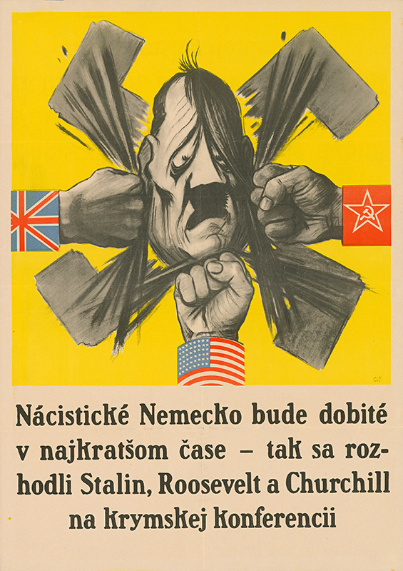](http://www.webumenia.sk/dielo/SVK:TMP.324?collection=88)

Slovenský štát sa pred koncom vojny ocitá v čoraz hlbšej medzinárodnej izolácii – krajiny antihitlerovskej koalície (Veľká Británia, USA, ZSSR) uznávajú československú exilovú vládu v Londýne. Nemeckú armádu a jej spojencov sovietske vojská neodvratne vytláčajú z územia ZSSR a v Taliansku v júli 1943 padá Mussoliniho fašistický režim. 

Predstavitelia ľudáckeho režimu, ktorý v zahraničí reprezentovali takí „diplomati“ ako napríklad veľvyslanec vo Vatikáne Karol Sidor, sa síce pokúšajú hovoriť o slovenskej štátnosti, no ich snahy sú odsúdené na neúspech. Osud ľudákov a ich štátu je zviazaný s osudom Hitlera a jeho Tretej ríše.

Nemci po okupácii formálne uznávajú slovenské štátne a aj civilné orgány, no ich autorita nepostačuje na to, aby zabránili hospodárskemu drancovaniu krajiny, práve naopak. Oficiálnu dohodu o zásobovaní nemeckej brannej moci aj pojem „vojnová korisť“ vysvetľujú nacisti po svojom. Zo Slovenska tak jeho „ochrancovia“ koncom vojny odvážajú materiál v hodnote niekoľkých miliárd slovenských korún. 

Sovietska Červená armáda vstupuje na Slovensko z viacerých smerov. Jednotky 1. ukrajinského frontu spolu s príslušníkmi Československého armádneho zboru sa prebíjajú v oblasti Duklianskeho priesmyku až 6. októbra 1944. Z juhovýchodu postupujú jednotky 2. ukrajinského frontu a rumunskej armády. 

<figure class="audio" markdown="1">

<figcaption><a href="http://www.memoryofnations.eu/witness/clip/id/288/clip/4234">Josef Činčala (1921) - Dukliansky priesmyk, Príbehy 20. storočia, Post Bellum SK</a></figcaption>
</figure>

[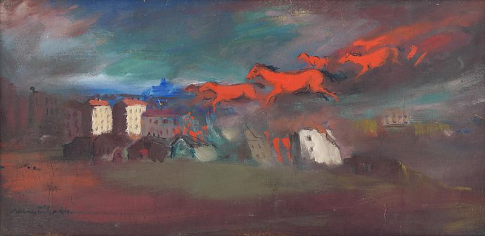](http://www.webumenia.sk/dielo/SVK:SNG.O_1786?collection=88)

Hornatý terén Slovenska, popretínaný riekami, sťažuje oslobodzovanie a nahráva ustupujúcim Nemcom. Boje na slovenskom území trvajú až do jari 1945. Väčšina územia je definitívne oslobodená vytlačením nacistických vojsk z Bratislavy 4. apríla 1945, no v niektorých oblastiach na severozápade sa Nemci držia až do začiatku mája. 

<figure class="audio" markdown="1">

<figcaption><a href="http://www.memoryofnations.eu/witness/clip/id/2864/clip/9394">Michal Hlavička (1923) - Oslobodenie Bratislavy, Príbehy 20. storočia, Post Bellum SK</a></figcaption>
</figure>

[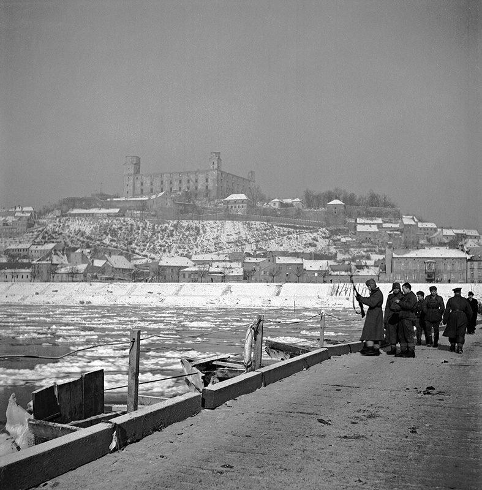](http://www.webumenia.sk/dielo/SVK:TMP.326)

Prezidenta a vodcu Jozefa Tisa spolu s ďalšími ľudáckymi činiteľmi 1. apríla 1945 evakuujú z Bratislavy do Holíča a následne opúšťajú územie republiky. Pod dočasnou ochranou nacistov sa ukrývajú na viacerých miestach dnešného Rakúska a Nemecka. Deň pred ich odchodom, 31. marca, je ešte z Bratislavy vypravený posledný transport slovenských účastníkov odboja do koncentračného tábora Mauthausen.

V tom istom čase prichádza do Košíc prezident Edvard Beneš, vedúca osobnosť československého exilu. Dňa 5. apríla 1945 vyhlasuje ním menovaná nová vláda tzv. Košický vládny program, ktorým definuje aj postavenie Slovenska v Československej republike. 

Druhá svetová vojna v Európe končí kapituláciou Nemecka 8. mája. Mimo európskeho kontinentu pokračuje až do 2. septembra, kedy ju definitívne ukončí kapitulácia Japonska.

Posledným krokom ľudáckej reprezentácie zanikajúcej Slovenskej republiky je memorandum o podriadení sa americkej armáde, ktoré 8. mája 1945 odovzdali v Kremsmünsteri predseda vlády Štefan Tiso a ministri Mikuláš Pružinský, Aladár Kočiš a Gejza Medrický.

---

## Osudy predstaviteľov slovenského štátu 

Po skončení druhej svetovej vojny sa v Európe začína obdobie vyrovnávania s kolaboráciou s nacistickým Nemeckom, ako aj súdneho stíhania jednotlivých vojnových zločincov. Na lavicu obžalovaných sa dostávajú páchatelia tých najohavnejších zločinov, ktorých stíhanie je v kompetencii práve na tento účel vytvoreného retribučného súdnictva. 

{% include 'partials/carousel.html.twig' with {
    'images': [
        {
            'title':'Ladislav Guderna - Satirická kresba 2.', 
            'src': 'http://www.webumenia.sk/images/diela/GMB/18/SVK_GMB.C_8963/SVK_GMB.C_8963.jpeg',
            'href': 'http://www.webumenia.sk/dielo/SVK:GMB.C_8963'
        },
		{ 
            'title':'Ladislav Guderna - Bez slov I.', 
			'src': 'http://www.webumenia.sk/images/diela/GMB/17/SVK_GMB.C_8962/SVK_GMB.C_8962.jpeg',
            'href': 'http://www.webumenia.sk/dielo/SVK:GMB.C_8962'
        },
        {
             'title':'Ladislav Guderna - Satirická kresba 2.', 
            'src': 'http://www.webumenia.sk/images/diela/GMB/78/SVK_GMB.C_15578/SVK_GMB.C_15578.jpeg',
            'href': 'http://www.webumenia.sk/dielo/SVK:GMB.C_15578'
        },
        {
            'title':'Ladislav Guderna - Satirická kresba 8.', 
            'src': 'http://www.webumenia.sk/images/diela/GMB/51/SVK_GMB.C_15584/SVK_GMB.C_15584.jpeg',
            'href': 'http://www.webumenia.sk/dielo/SVK:GMB.C_15584'
            }
    ]
}%}

Výnimkou nie je ani Československo, kde sa potrestaním okupantov, zradcov a kolaborantov zaoberajú špeciálne zriadené ľudové súdy. Väčšina procesov s hlavnými politickými predstaviteľmi slovenského štátu je vedená pred Národným súdom – najvyššou inštanciou ľudového súdnictva na Slovensku.  

[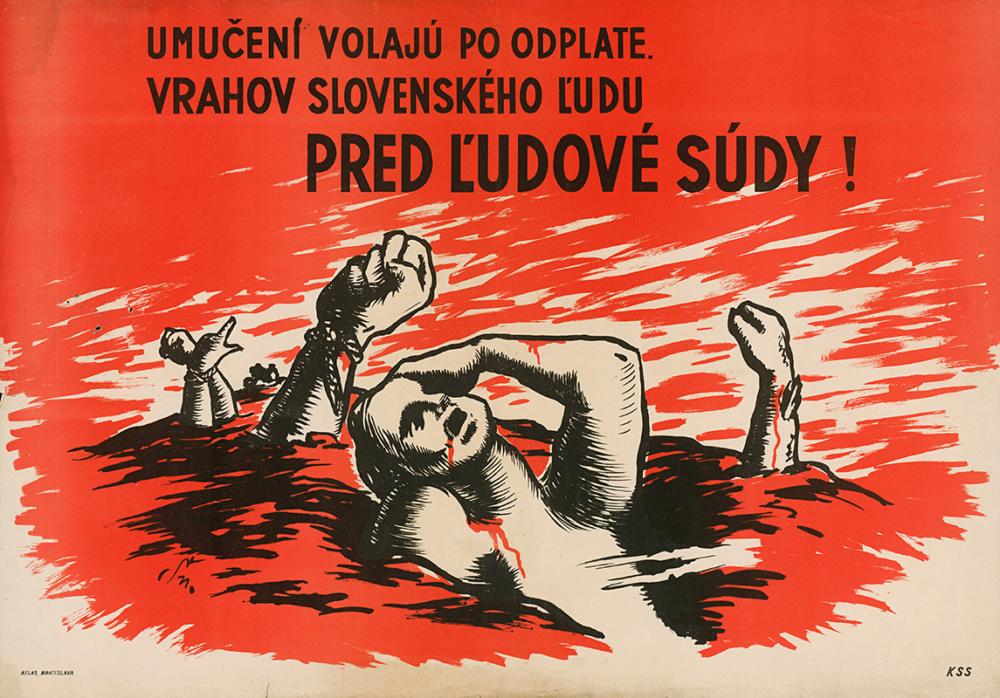](http://www.webumenia.sk/dielo/SVK:TMP.317?collection=88)

[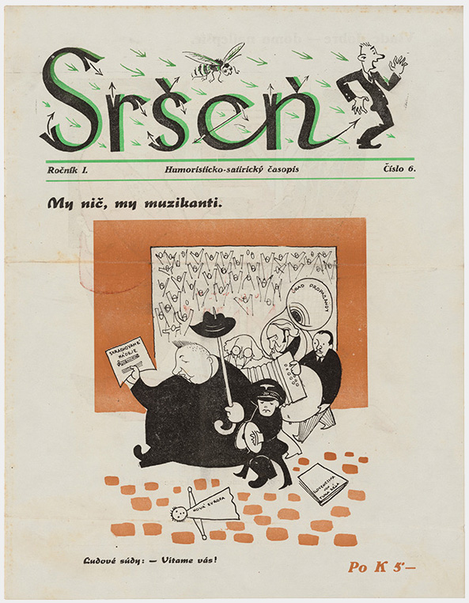](http://www.webumenia.sk/dielo/SVK:TMP.318)

**Vojtech Tuka** - vedúca osobnosť radikálneho krídla HSĽS, bývalý predseda slovenskej vlády a minister zahraničných vecí, ktorý však neskôr vypadol z užšieho predsedníctva HSĽS a zo zdravotných dôvodov rezignoval v roku 1944 zo všetkých vládnych postov. V roku 1946 bol odsúdený na trest smrti a popravený. 

**Alexander Mach** - minister vnútra a dlhoročný Hlavný veliteľ Hlinkovej gardy. Popredná osobnosť radikálneho krídla HSĽS a jeden z hlavných organizátorov protižidovskej politiky na Slovensku. Súdený je spoločne s prezidentom Jozefom Tisom a neprítomným Ferdinandom Ďurčanským. Národný súd ho napokon odsúdi na 30 rokov väzenia, trest mu však neskôr zmierňujú na 25 rokov. Napokon je na základe amnestie na slobodu prepustený v roku 1968. 

**Karol Sidor** - pôvodne radikálny ľudák a prvý Hlavný veliteľ Hlinkovej gardy, bývalý štátny minister a krátko aj predseda autonómnej vlády. V marci 1939 pre neochotu vyhlásiť Slovenský štát upadol do nemilosti Nemcov a bol presunutý na post vyslanca vo Vatikáne. V neprítomnosti odsúdený na 20 rokov väzenia. Na trest nenastúpi, zostáva až do smrti v emigrácii. 

**Ferdinand Ďurčanský** - pôvodne predstaviteľ radikálneho ľudáckeho krídla, ktorý sa v roku 1938 zasadzoval o likvidáciu demokracie, rozbitie Československa a vyhlásenie slovenskej samostatnosti. Minister autonómnej slovenskej vlády, jeden z iniciátorov návrhov protižidovských noriem a po vzniku Slovenského štátu jeho prvý minister zahraničných vecí a do leta roku 1940 aj minister vnútra. Neuvedomil si včas reálne hranice svojich právomocí, a tak upadol do nemilosti Nemcov a v lete 1940 bol odstránený z vrcholovej politiky. V neprítomnosti bol odsúdený na trest smrti. Trestu sa vyhne vďaka emigrácii do Argentíny, neskôr sa presťahuje do Mníchova. 

**Jozef Tiso** - od jesene 1938 do jari 1939 predseda autonómnej vlády, prvý predseda vlády po vzniku Slovenského štátu, od jesene 1939 prezident Slovenskej republiky a vrchný veliteľ jej ozbrojených síl, predseda Hlinkovej slovenskej ľudovej strany, neskôr s titulom „Vodca“, teda i Najvyšší veliteľ Hlinkovej gardy. Rovnako ako Ferdinand Ďurčanský je v apríli 1947 odsúdený na trest smrti. O pár dní neskôr je popravený obesením. 

V rámci retribučného súdnictva je do konca roku 1948 na Slovensku súdených celkovo 22 278 obžalovaných, odsúdených je asi 9 000 osôb.

<figure class="audio" markdown="1">

<figcaption><a href="http://www.memoryofnations.eu/witness/clip/id/3642/clip/16053">Oto Šimko (1924) - Byť slobodný je ohromný pocit, Príbehy 20. storočia, Post Bellum SK</a></figcaption>
</figure>

[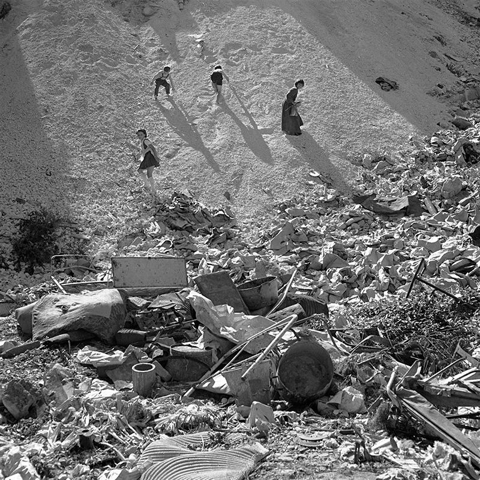](http://www.webumenia.sk/dielo/SVK:TMP.326)

Vďaka Slovenskému národnému povstaniu je Slovensko v povojnovej Európe vnímané ako plnohodnotná súčasť víťaznej protihitlerovskej koalície. Slovenský štát ostáva smutným mementom hrozby nacionalizmu, fašizmu, systematického rozkladu demokracie a potláčania ľudských práv. Napriek tomu sú doteraz zločiny ľudáckeho režimu mnohými relativizované, vojnové udalosti zabudnuté, ignorované či popierané. 

Nedovoľme, aby sa história násilia a fašistickej totality opakovala.

**Diela a fotografie z tejto kapitoly nájdete aj v kolekcii na Webe umenia: [Vytriezvenie zo sna](http://www.webumenia.sk/kolekcia/88 "Kolekcia Vytriezvenie zo sna")**