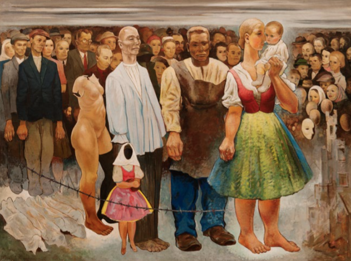

Andrej Hlinka sa do slovenských dejín zapísal ako politik, publicista, prekladateľ, najmä však ako veľký národovec. Narodil sa ako jeden z deviatich súrodencov v robotníckej rodine a vyštudoval teológiu v seminári v Spišskej kapitule. Počas svojho kaplánskeho pôsobenia na Orave si získal obľubu ľudu a začal sa angažovať aj politicky. Najprv pôsobil v Uhorskej ľudovej strane, ktorá však nenaplnila jeho očakávania v oblasti v riešení otázky nemaďarských národov Uhorska, medzi ktoré v tom čase Slováci patrili.

Po krátkom pôsobení v Slovenskej národnej strane sa stal spoluzakladateľom novej Slovenskej ľudovej strany, neskôr aj jej predsedom v dobách najväčšieho rozmachu v medzivojnovom období. Popri svojom pôsobení v strane bol tiež účastníkom a spoluzakladateľom Slovenskej národnej rady v Martine, zakladateľom slovenskej kníhtlačiarne Lev, členom výboru Matice slovenskej, predsedom Spolku svätého Vojtecha, nositeľom titulu pápežský komorník a apoštolským protonotárom. Prežil dokonca dva pokusy o atentát na svoju osobu a skonal v auguste 1938 a na predsedníckom poste ho v strane nahradil Jozef Tiso.